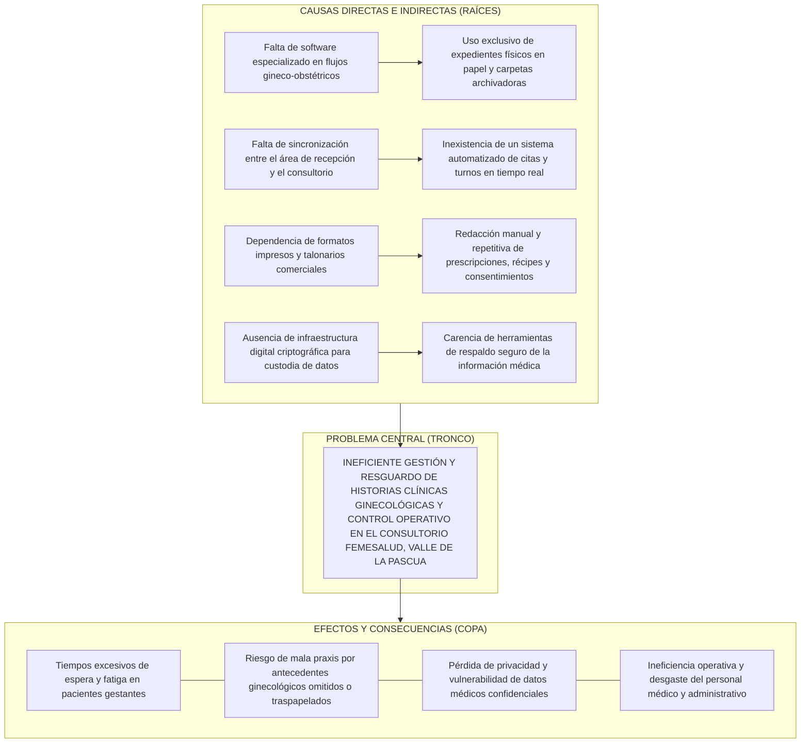
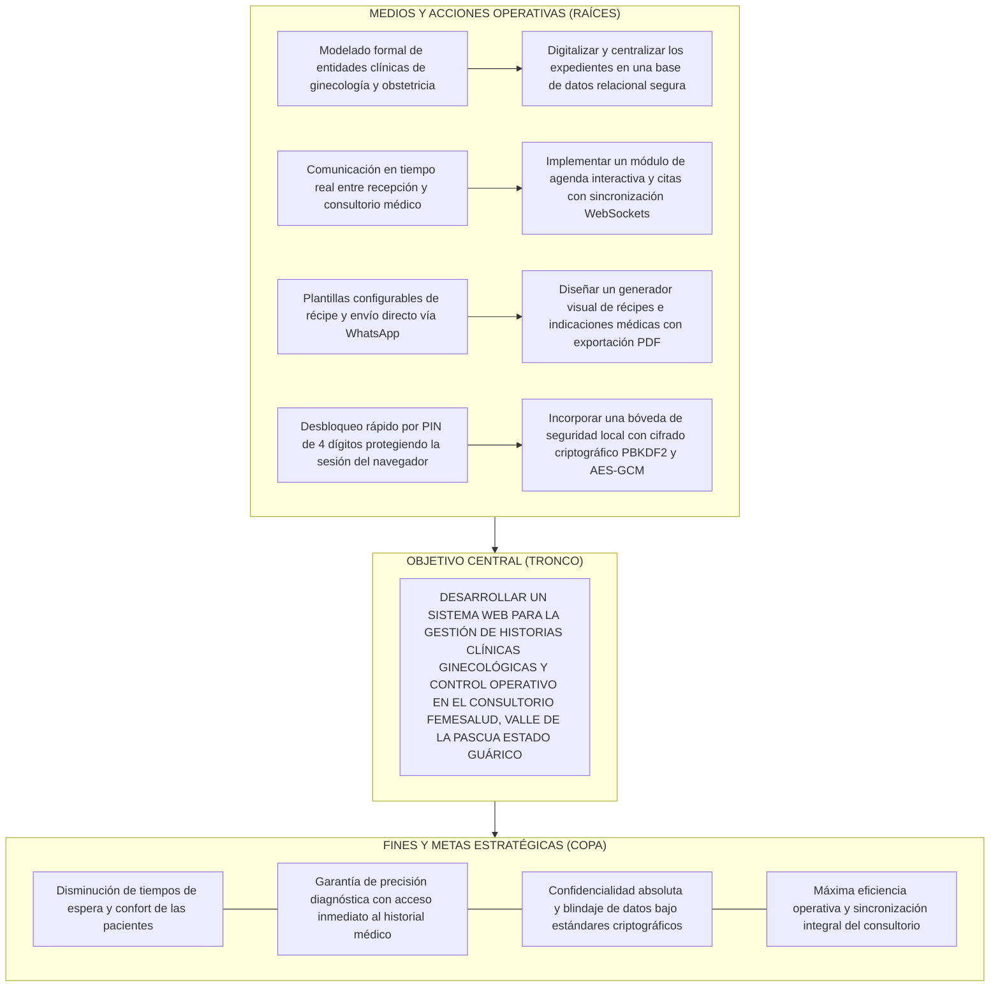

# FASE I: DIAGNÓSTICO PARTICIPATIVO

**Enfoque: Inserción comunitaria y determinación del problema.**

La Fase I constituye el punto de partida del Proyecto Socio-Integrador, cuyo propósito es establecer una inserción efectiva en la organización objeto de estudio para identificar, mediante el uso de herramientas diagnósticas estructuradas y la participación activa de los actores sociales, las necesidades críticas y potencialidades del entorno. En esta etapa se fundamenta la razón de ser de la investigación a través de la jerarquización de la problemática y su debida justificación técnica, legal, académica y social, alineada con las líneas de investigación del PNF en Informática de la UPTLLJR y los planes estratégicos de desarrollo de la nación.

---

## Descripción del Contexto

### Localización Geográfica
El proyecto socio-integrador se localiza en la **Clínica FemeSalud**, consultorio de atención médica ginecológica y obstétrica bajo la responsabilidad de la **Dra. Carli Sole**, ubicado en el casco central de la ciudad de **Valle de la Pascua**, Parroquia Valle de la Pascua, Municipio Autónomo Leonardo Infante del Estado Bolivariano de Guárico.

* **Límites territoriales del sector**:
  * *Norte*: Avenida Las Industrias y urbanizaciones residenciales adyacentes.
  * *Sur*: Calle Guanto y zona comercial central de Valle de la Pascua.
  * *Este*: Avenida Rómulo Gallegos.
  * *Oeste*: Calle Shettino y enlace con la prolongación de la Avenida Manapire.
* **Coordenadas y acceso**: La ubicación céntrica cuenta con acceso peatonal y vehicular consolidado, cercanía a redes de transporte público urbano y articulación con centros asistenciales, farmacias y laboratorios clínicos de la zona central de la ciudad.

### Dimensión Histórica
El consultorio médico de la Dra. Carli Sole surge como una iniciativa profesional orientada a cubrir la alta demanda de atención médico-quirúrgica y preventiva en las especialidades de Ginecología y Obstetricia en Valle de la Pascua y poblaciones circunvecinas del oriente del estado Guárico (Tucupido, Zaraza, El Socorro, Santa María de Ipire). A lo largo de su ejercicio profesional, la Dra. Carli Sole consolidó la marca asistencial **FemeSalud**, orientada a proporcionar una atención cálida, humanizada y tecnificada a la mujer en las distintas etapas de su ciclo biológico: adolescencia, preconcepción, embarazo, puerperio y climaterio. Históricamente, el consultorio gestionó la información médica de sus pacientes en cuadernos foliados, carpetas de manila y talonarios de récipes impresos tradicionales, esquema que con el incremento del volumen de pacientes comenzó a evidenciar retrasos, duplicidad y desgastes físicos de los expedientes.

### Dimensión Comunitaria
Desde el punto de vista comunitario, la Clínica FemeSalud se articula directamente con la comunidad de usuarias de la entidad. Las pacientes provienen de diversos estratos sociales que acuden en búsqueda de diagnósticos tempranos, control prenatal exhaustivo y pesquisa de patologías ginecológicas mediante citología y ecografía. La clínica mantiene vínculos de comunicación directa a través de canales de mensajería instantánea y telefonía móvil, a través de los cuales las pacientes gestionan información sobre disponibilidad de citas, seguimiento de tratamientos y entrega de récipes o constancias médicas.

### Dimensión Económica
La organización se inscribe en el sector terciario de la economía regional, prestando servicios médicos privados de salud. Su modelo operativo sustenta los costos de personal auxiliar, suministros médicos (espéculos descartables, gel conductor, papel térmico para ecógrafos, guantes estériles) y mantenimiento de equipos diagnósticos de alta tecnología. La dinámica económica regional exige manejar esquemas de facturación y cobranza multimoneda (Bolívares soberanos a través de Pago Móvil/transferencias bancarias y Divisas en efectivo o plataformas electrónicas como Zelle), requiriendo un control estricto de caja chica, flujo de ingresos diarios y control de insumos consumibles.

### Dimensión Social
La población beneficiaria directa está constituida por mujeres y familias del municipio Leonardo Infante. La atención oportuna de la salud sexual y reproductiva incide directamente en la reducción de tasas de morbimortalidad materna e infantil, el diagnóstico precoz de lesiones precursoras del cáncer de cuello uterino y la detección temprana de anomalías fetales. Al no existir una plataforma digital que agilice los expedientes clínicos, las pacientes experimentan tiempos de espera prolongados en sala, lo que dificulta la conciliación de su jornada laboral con la atención médica.

### Dimensión Cultural
En la región llanera venezolana, la salud ginecológica y reproductiva ha estado históricamente rodeada de temores, prejuicios culturales y vacilaciones que retardan la consulta preventiva. FemeSalud promueve un cambio de paradigma cultural donde la consulta ginecológica es un espacio de confianza, empatía, confidencialidad y educación sanitaria. Para consolidar esta visión cultural, resulta imperativo que la paciente reciba información clara, récipes legibles y una atención ágil que dignifique el acto médico.

### Dimensión Ambiental
El ejercicio de la medicina ambulatoria genera desechos físicos de naturaleza biológica y administrativa. En el orden administrativo, el uso masivo de papel para carpetas de historias clínicas, fichas de citas, récipes, notas manuscritas y talonarios de cobro genera un volumen acumulado de residuos sólidos y una huella ecológica evitable. La sustitución de expedientes impresos por una plataforma digital web con emisión de constancias y prescripciones en formato digital (PDF) enviado por canales electrónicos representa un salto cualitativo hacia la sustentabilidad ambiental y la reducción del consumo papelero dentro del consultorio.

### Dimensión Institucional
El consultorio opera bajo el marco regulatorio del Ministerio del Poder Popular para la Salud (MPPS), la Contraloría Sanitaria y el Colegio de Médicos del Estado Guárico. Asimismo, el proyecto socio-integrador formaliza un canal de cooperación interinstitucional entre la unidad de salud privada y la Universidad Politécnica Territorial de los Llanos "Juana Ramírez" (UPTLLJR), a través de su Departamento de Informática, propiciando la transferencia tecnológica, el desarrollo endógeno de soluciones informáticas y el cumplimiento de las metas curriculares de formación profesional.

### Actores Involucrados
1. **Dra. Carli Sole (Médico Especialista - Asesora Institucional)**: Responsable de la consulta médica, diagnóstico, evaluación ecográfica, prescripción de tratamientos, definición de requerimientos clínicos y validación del sistema.
2. **Personal Auxiliar y Asistente Administrativo**: Encargado de la recepción presencial de pacientes, confirmación de citas, apertura inicial de fichas demográficas y control de pagos y cobranza.
3. **Comunidad de Pacientes Usuarias**: Receptores de los servicios clínicos, citas programadas, prescripciones médicas y seguimiento prenatal.
4. **Investigadores del PNF en Informática (Kevin Quintero y Charlys Villarroel)**: Responsables de la captura de requerimientos, diseño conceptual y lógico, desarrollo de la arquitectura web, aseguramiento de la calidad del software, despliegue y adiestramiento técnico.
5. **Tutor Académico (Prof. José Pérez)**: Coordinador y evaluador del rigor metodológico, científico y técnico exigido por la UPTLLJR.

---

## Diagnóstico Situacional

Para diagnosticar con rigor técnico y participativo la situación operativa y de gestión de datos en el consultorio, se aplicó la técnica de la matriz de Fortalezas, Oportunidades, Debilidades y Amenazas (FODA) en sesiones de trabajo conjunto entre el equipo de desarrollo de la UPTLLJR y la Dra. Carli Sole.

**Tabla 1**  
*Matriz FODA del Consultorio FemeSalud*

| Factores Internos | Fortalezas (F) | Debilidades (D) |
| :--- | :--- | :--- |
| | 1. Alta cualificación y reputación médica de la Dra. Carli Sole en Valle de la Pascua. 2. Equipamiento médico y ecográfico de última tecnología. 3. Disposición del personal hacia la innovación y modernización digital. 4. Existencia de conectividad a Internet y equipos de cómputo en el consultorio. | 1. Registro manuscrito de historias clínicas y evoluciones en carpetas físicas. 2. Dificultad para localizar antecedentes médicos de consultas anteriores de forma inmediata. 3. Tiempos prolongados en la redacción manual de récipe e indicaciones. 4. Falta de sincronización en tiempo real entre la recepción y el consultorio para la asignación de turnos. |
| **Factores Externos** | **Oportunidades (O)** | **Amenazas (A)** |
| | 1. Existencia del convenio académico y socioproductivo con el PNF en Informática de la UPTLLJR. 2. Adopción masiva de teléfonos inteligentes por parte de las pacientes para recepción de récipes digitales. 3. Disponibilidad de tecnologías web y bases de datos seguras de código abierto o bajo consumo de recursos. 4. Políticas nacionales que impulsan la soberanía tecnológica y digitalización de servicios públicos y privados. | 1. Inestabilidad en el suministro eléctrico o fluctuaciones del servicio de telecomunicaciones en la entidad. 2. Riesgo de deterioro, incendio, extravío o acceso no autorizado a los archivos físicos de papel. 3. Costos crecientes de insumos de papelería, tinta de impresión y carpetas físicas. 4. Resistencia inicial de algunas pacientes de edad avanzada a los formatos estrictamente digitales. |

*Nota.* Elaboración propia (2026), con base en sesiones de diagnóstico participativo efectuadas en la Clínica FemeSalud.

---

### Jerarquización e Identificación de las Necesidades

Mediante mesas de trabajo participativo, se listaron los nudos críticos detectados y se procedió a su ponderación mediante una matriz de priorización basada en los criterios de Gravedad (G), Viabilidad Técnica (VT), Impacto Comunitario (IC) y Tendencia al Empeoramiento (TE), empleando una escala del 1 (muy bajo) al 5 (muy alto).

**Tabla 2**  
*Tabla de Priorización y Jerarquización de Necesidades*

| Problema Identificado | G (1-5) | VT (1-5) | IC (1-5) | TE (1-5) | Total | Jerarquía |
| :--- | :---: | :---: | :---: | :---: | :---: | :---: |
| **Ineficiencia en el resguardo, búsqueda y registro de historias clínicas gineco-obstétricas y gestión operativa** | 5 | 5 | 5 | 5 | **20** | **Prioridad 1** |
| Retrasos en el agendamiento y confirmación de citas médicas y control de turnos en sala de espera | 4 | 5 | 4 | 4 | 17 | Prioridad 2 |
| Lentitud en la emisión manual de récipes médicos, récipe gráfico y justificativos de reposo | 4 | 5 | 4 | 3 | 16 | Prioridad 3 |
| Descontrol en la conciliación multimoneda de caja chica, pagos móviles y cobranza de honorarios | 3 | 4 | 3 | 4 | 14 | Prioridad 4 |
| Ausencia de un inventario automatizado de insumos médicos descartables en el consultorio | 3 | 4 | 3 | 3 | 13 | Prioridad 5 |

*Nota.* Elaboración propia (2026). La escala total suma los 4 criterios de impacto analizados.

#### Árbol de Problemas

---

## Planteamiento del Problema

### Descripción Narrativa de la Problemática

Para formular con precisión la problemática de investigación, se da respuesta a las siete (07) interrogantes metodológicas exigidas por el manual de la UPTLLJR:

1. **¿Cuál es la situación actual?**  
   En el consultorio de la Clínica FemeSalud, la Dra. Carli Sole y su asistente administran las consultas, diagnósticos ecográficos y antecedentes médicos de decenas de pacientes semanales utilizando fichas de papel, libretas de citas y talonarios impresos. Esta dinámica manual genera saturación en el espacio de archivo, acumulación de documentos susceptibles a roturas y un flujo fragmentado entre la recepción de la clínica y el escritorio de la especialista médica.

2. **¿Desde cuándo ocurre?**  
   Esta situación ha prevalecido desde los inicios operativos del consultorio. Sin embargo, en los últimos dos años, con el crecimiento sostenido de la cartera de pacientes y la complejidad de los controles de gestantes de alto riesgo obstétrico, el volumen documental sobrepasó la capacidad de control manual, haciendo urgente la adopción de un sistema automatizado.

3. **¿A quiénes afecta y cómo?**  
   Afecta principalmente a la especialista médica (Dra. Carli Sole), quien debe destinar minutos valiosos de la consulta a buscar hojas de evolución previas o redactar a mano tratamientos repetitivos; al personal de recepción, sobrecargado por la búsqueda de expedientes físicos en archivadores; y a las pacientes, quienes padecen retrasos innecesarios en la sala de espera y corren el riesgo de que sus prescripciones manuales resulten difíciles de descifrar en farmacia.

4. **¿Qué se ha hecho al respecto?**  
   Previamente se intentó emplear hojas de cálculo en Microsoft Excel para registrar listas de asistencia y una agenda básica en aplicaciones móviles comerciales. No obstante, dichas herramientas son aisladas, carecen de formatos clínicos especializados (fórmulas obstétricas, FUM, FPP, ecografías), no permiten el trabajo colaborativo simultáneo y representan una grave vulnerabilidad de seguridad al no estar cifradas ni contar con control de acceso por roles.

5. **¿Qué pasa si no se resuelve?**  
   De mantenerse el esquema manual, el consultorio enfrentará la pérdida o deterioro irreversible de expedientes médicos ante la humedad, el paso del tiempo o accidentes imprevistos. Asimismo, aumentará la probabilidad de incurrir en confusiones en antecedentes alérgicos de las pacientes, se perpetuará el gasto continuo en papelería y se limitará la capacidad de crecimiento del consultorio.

6. **¿Qué nos motivó a investigarlo?**  
   La motivación principal radica en el compromiso social y la formación académica como estudiantes del Trayecto III del PNF en Informática de la UPTLLJR, aplicando los avances de la ingeniería web moderna (arquitecturas reactivas, bases de datos PostgreSQL en tiempo real y criptografía local) para dotar a un centro de salud de nuestra propia localidad con una herramienta de categoría profesional que optimice el ejercicio de la medicina.

7. **¿Cuál es la interrogante central que el proyecto busca responder? (Hipótesis)**  
   *¿De qué manera el desarrollo e implementación de un sistema web integral permitirá optimizar la gestión de historias clínicas ginecológicas y el control operativo en el consultorio FemeSalud de la ciudad de Valle de la Pascua, estado Guárico?*

---

### Árbol de Objetivos

---

### Matriz de Marco Lógico (MML)

**Tabla 3**  
*Matriz de Marco Lógico (MML) del Proyecto*

| Nivel de Objetivos | Resumen Narrativo | Indicadores Objetivamente Verificables | Medios de Verificación | Supuestos Críticos |
| :--- | :--- | :--- | :--- | :--- |
| **Fin** | Contribuir a la modernización tecnológica y calidad del servicio asistencial de salud ginecológica en Valle de la Pascua mediante soluciones informáticas seguras. | 1. Reducción del 50% o más en tiempos de espera general de las pacientes. 2. Cero pérdida o daño físico de expedientes médicos. | Encuestas de satisfacción a pacientes e informes semestrales del consultorio. | Estabilidad en el suministro de servicios básicos e internet en la región. |
| **Propósito** | Optimizar la gestión de historias clínicas y el flujo administrativo-operativo del consultorio FemeSalud mediante un sistema web automatizado. | 1. 100% de las consultas y evoluciones registradas de manera digital. 2. Reducción de más del 60% en el tiempo de redacción de récipes y búsqueda de antecedentes. | Registros en la base de datos PostgreSQL y auditoría del sistema web. | Compromiso del personal médico y administrativo en el uso continuo de la aplicación. |
| **Componentes (Resultados)** | 1. Módulo de Historia Clínica Digital (Ginecología y Obstetricia). 2. Módulo de Citas y Agenda en Tiempo Real. 3. Generador Visual de Récipes en PDF y envíos digitales. 4. Módulo de Facturación, Caja Chica e Inventario. 5. Bóveda Criptográfica Local de PIN para autenticación rápida. | 1. 5 módulos completamente funcionales e integrados. 2. Sistema de autenticación con cifrado PBKDF2/AES-GCM operativo en menos de 1 segundo. 3. Exportación de PDF clínicos con alta resolución visual. | Código fuente validado en repositorio Git, pruebas funcionales de caja negra y manuales técnicos. | Aceptación de los prototipos por parte de la especialista Dra. Carli Sole. |
| **Actividades** | 1.1 Diagnóstico de requerimientos mediante entrevistas clínicas. 2.1 Modelado de base de datos relacional y diagramas UML. 3.1 Codificación frontend en React 19/Tailwind y backend en Supabase. 4.1 Ejecución de pruebas unitarias y de integración. 5.1 Despliegue en la nube (Vercel) y capacitación del personal. | 1. Cronograma de actividades cumplido al 100%. 2. Matriz de pruebas de software con 100% de casos aprobados. 3. 100% del personal capacitado satisfactoriamente. | Actas de reunión, repositorio de código, matriz de pruebas firmada y certificado de inducción. | Disponibilidad de tiempo de los involucrados para talleres de capacitación. |

*Nota.* Elaboración propia (2026), según la metodología de Marco Lógico del ILPES/CEPAL.

---

## Objetivos del Proyecto

### Objetivo General
Desarrollar un sistema web para la gestión de historias clínicas ginecológicas y control operativo en el consultorio FemeSalud, Valle de la Pascua, estado Guárico.

### Objetivos Específicos
1. **Diagnosticar** la situación actual de los procesos de registro de historias clínicas, asignación de citas, prescripción médica y control financiero en el consultorio FemeSalud.
2. **Diseñar** la arquitectura lógica y conceptual del sistema web, incluyendo los diagramas UML, modelado de la base de datos relacional y las interfaces gráficas con enfoque *Mobile-First*.
3. **Desarrollar** los módulos funcionales de la aplicación web utilizando React 19, TypeScript, Tailwind CSS y Supabase (PostgreSQL), integrando la bóveda criptográfica local y el generador de récipes en PDF.
4. **Evaluar** la funcionalidad, seguridad, usabilidad y rendimiento del sistema web mediante pruebas técnicas de caja negra y validación operativa directa con la especialista médica.

---

## Justificación de la Investigación

La presente investigación se fundamenta técnica, social y académicamente en virtud de las siguientes dimensiones:

* **Aporte Económico**: El consultorio FemeSalud experimenta una disminución sustancial y permanente en el gasto recurrente de resmas de papel, carpetas de archivo, impresiones de talonarios comerciales y tintas. Asimismo, el módulo financiero permite consolidar los ingresos diarios en bolívares y divisas, previniendo fugas de capital y optimizando el cobro de consultas y procedimientos ecográficos.
* **Aporte Social**: El bienestar y dignidad de la mujer como núcleo familiar se ven directamente favorecidos. Al agilizarse la gestión de citas y acortarse los tiempos improductivos de espera en sala, las pacientes reciben una atención más oportuna y humana. Asimismo, se preserva el derecho a la intimidad y la confidencialidad de datos biológicos de alta sensibilidad.
* **Aporte Práctico**: La solución ofrece una respuesta concreta a las necesidades operativas de la Dra. Carli Sole. Al disponer de una búsqueda instantánea de antecedentes médicos, cálculo automatizado de semanas de gestación y fecha probable de parto (FPP), y un generador visual de prescripciones exportables a PDF para su envío instantáneo por WhatsApp, se erradican los cuellos de botella del ejercicio diario.
* **Aporte Teórico**: El proyecto contribuye al acervo de la informática médica en Venezuela, aportando un modelo documentado de integración de arquitecturas reactivas en el cliente (*Single Page Applications* con React 19 y TanStack Router) con plataformas *Backend-as-a-Service* (Supabase/PostgreSQL) y algoritmos criptográficos nativos en el navegador (`SubtleCrypto`).
* **Aporte Académico**: Constituye la materialización práctica de los conocimientos adquiridos a lo largo de tres años formativos en el PNF en Informática de la UPTLLJR, evidenciando el dominio de las fases del ciclo de vida del software, el diseño centrado en el usuario y la ingeniería de datos en contextos reales.
* **Aporte Institucional**: Consolida la vinculación universidad-entorno productivo, demostrando la capacidad de la UPTLLJR para brindar asesoría tecnológica y soluciones de alto nivel a organizaciones de la región de los llanos guariqueños.
* **Aporte Metodológico y Vinculación con Políticas de Estado**: La investigación se inscribe en la metodología de Investigación Acción Participativa (IAP) combinada con metodologías ágiles de desarrollo de software (Scrum), alineándose con:
  * La **Línea de Investigación del PNF en Informática**: *Desarrollo de Soluciones Informáticas y Gestión de Datos*, orientada al fortalecimiento tecnológico de las instituciones locales.
  * El **Plan de Desarrollo Económico y Social de la Nación (Plan de la Patria)**: En su **Objetivo Histórico I** (Consolidar la independencia nacional a través de la soberanía científica y tecnológica) y el **Objetivo Nacional 1.5** (Desarrollar capacidades científicas y tecnológicas vinculadas a las necesidades del pueblo venezolano, priorizando el sector de la salud pública y asistencial).
