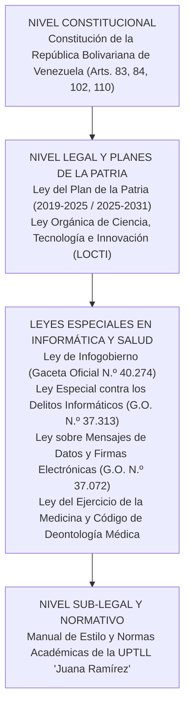

# FASE II: REVISIÓN LITERARIA (EL SOPORTE CIENTÍFICO)

**Enfoque: Sustento científico, referencial y legal.**

La Fase II comprende el soporte teórico, científico y normativo que fundamenta la investigación, contextualizando el desarrollo del sistema web dentro de un cuerpo de conocimientos rigurosamente validados en el campo de la ingeniería de software y la informática aplicada a la salud.

---

## Antecedentes de la Investigación

De conformidad con las directrices académicas de la UPTLLJR, se seleccionaron investigaciones previas de carácter internacional (03) y nacional/regional (03) directamente relacionadas con sistemas de historias clínicas, plataformas web asistenciales y seguridad informática médica.

### Antecedentes Internacionales

1. **Gómez, R. y Mendoza, L. (2023)**, en Colombia, desarrollaron un trabajo de grado titulado *"Diseño e implementación de un sistema web para el control de historias clínicas y asignación de citas en un centro de atención materno-infantil en Bogotá"*, presentado en la Universidad Distrital Francisco José de Caldas. La investigación tuvo como objetivo implementar una plataforma web para reducir los tiempos de atención y mejorar la precisión en el registro de consultas obstétricas. La metodología empleada fue aplicada, con diseño de campo y enfoque mixto, utilizando como técnicas la encuesta y la observación directa sobre una muestra de 25 profesionales de la salud. Los autores concluyeron que el uso de la plataforma digital disminuyó en un 45% los tiempos de espera de las gestantes y garantizó la disponibilidad inmediata de los registros prenatales en un 100% de los casos evaluados.  
   *Aporte a la investigación*: Este antecedente aporta a nuestro proyecto la estructura metodológica para evaluar el impacto en los tiempos de espera asistenciales y valida la efectividad del uso de plataformas web en la especialidad gineco-obstétrica en el contexto latinoamericano. Asimismo, brinda pautas para la confección de formularios orientados a controles prenatales periódicos, diferenciándose el presente trabajo al incorporar un esquema de sincronización reactiva en tiempo real y una arquitectura de desbloqueo criptográfico con PIN local para la sesión del especialista.

2. **Castillo, E. y Paredes, S. (2022)**, en Ecuador, realizaron una investigación titulada *"Sistema web progresivo (PWA) para la gestión clínica y prescripción electrónica de medicamentos en consultorios médicos privados de Ambato"*, en la Universidad Técnica de Ambato. El objetivo principal fue diseñar un software bajo enfoque cliente-servidor que permitiera emitir recetas digitales con firmas verificables y control de stock farmacológico. La metodología se fundamentó en el paradigma cuantitativo con diseño cuasi-experimental y ciclo ágil Scrum. Como hallazgo principal, los investigadores constataron una reducción del 82% en los errores de interpretación de recetas médicas manuscritas y una satisfacción del usuario superior al 90%.  
   *Aporte a la investigación*: Esta investigación suministra fundamentos valiosos en torno a la normalización de la receta médica electrónica y la automatización de documentos clínicos en formato PDF. Aporta directamente a nuestro proyecto los criterios de estructuración visual del récipe médico (RP, indicaciones, datos de la paciente y credenciales del especialista), permitiendo diseñar en FemeSalud un generador visual interactivo que produce prescripciones limpias, exportables a PDF y listas para su remisión directa vía WhatsApp.

3. **Martínez, A., Sánchez, D. y Ortiz, F. (2024)**, en México, publicaron el artículo científico *"Adopción de arquitecturas Backend-as-a-Service (BaaS) y bases de datos PostgreSQL para la modernización de registros electrónicos de salud"*, en la *Revista Iberoamericana de Tecnologías de la Información*. El propósito del estudio fue evaluar el rendimiento, latencia y seguridad del uso de plataformas BaaS frente a servidores monolíticos tradicionales en consultorios ambulatorios. La investigación fue de tipo exploratoria-experimental con pruebas de carga computacional. Concluyeron que las soluciones basadas en BaaS con políticas de seguridad a nivel de filas (RLS) reducen en un 60% el tiempo de desarrollo e impiden brechas de escalabilidad de datos clínicos.  
   *Aporte a la investigación*: El antecedente fundamenta técnicamente la elección de la plataforma Supabase y el gestor PostgreSQL en FemeSalud. Aporta la validación empírica de que el modelo BaaS ofrece alta disponibilidad, cifrado en tránsito y sincronización por sockets en tiempo real sin requerir una infraestructura de servidores pesada o de costoso mantenimiento local, lo cual resulta idóneo para la realidad tecnológica y económica de los centros de salud ambulatorios venezolanos.

---

### Antecedentes Nacionales y Regionales

1. **Rondón, J. y Alvarado, M. (2023)**, en San Juan de los Morros, Estado Guárico, presentaron en la Universidad Nacional Experimental Rómulo Gallegos (UNERG) el proyecto titulado *"Sistema automatizado para la gestión de expedientes clínicos y control de citas médicas en el Centro Clínico Universitario"*. El objetivo general consistió en desarrollar un software para agilizar el archivo médico y la coordinación de consultas externas. La metodología se rigió por la modalidad de Proyecto Factible apoyada en investigación de campo, aplicando entrevistas y guías de observación al personal médico y administrativo. Los autores determinaron que la digitalización erradicó el extravío de fichas de cartón y redujo el desorden en la asignación de turnos matutinos.  
   *Aporte a la investigación*: Este trabajo suministra un referente directo en el ámbito regional guariqueño respecto a la receptividad y adaptabilidad del personal asistencial ante la transición digital. Aporta los requerimientos esenciales del flujo de admisión de pacientes y demuestra la viabilidad de implementar sistemas clínicos en la entidad, sirviendo de base comparativa para nuestra investigación, la cual profundiza en la especialización ginecológica y en la experiencia de usuario táctil para dispositivos móviles.

2. **Hernández, K. y Morales, G. (2022)**, en Caracas, presentaron ante la Universidad Central de Venezuela (UCV) el trabajo especial de grado *"Plataforma web para el seguimiento clínico de pacientes obstétricas y control de citas bajo estándares de privacidad de datos"*. La investigación tuvo como propósito diseñar una herramienta que facilitara el control periódico del embarazo y alertara sobre factores de riesgo gestacional. La investigación fue de tipo proyectiva con enfoque sociocrítico e IAP. Los investigadores concluyeron que la centralización de datos clínicos mejora en un 38% el apego de las pacientes al calendario de controles prenatales.  
   *Aporte a la investigación*: El estudio aporta elementos esenciales para la definición de los campos médicos de la historia obstétrica (cálculo de edad gestacional por FUM, fecha probable de parto por regla de Naegele, antecedentes obstétricos G-P-A-C y ecografías de control). Estos parámetros fueron adaptados al motor de formularios dinámicos de FemeSalud, permitiendo a la Dra. Carli Sole registrar de forma rápida y estructurada cada variable biomédica crítica.

3. **Torres, V. y Bravo, P. (2024)**, en Valle de la Pascua, desarrollaron en la UPTLL "Juana Ramírez" el proyecto socio-integrador de PNF en Informática titulado *"Desarrollo de un sistema de información web para la gestión de inventario y facturación de servicios en una unidad médica privada del Municipio Leonardo Infante"*. La investigación persiguió automatizar la cobranza multimoneda y el control de suministros médicos. Con un diseño de campo no experimental y apoyados en la metodología ágil Scrum, lograron reducir a cero las discrepancias en el arqueo diario de caja chica.  
   *Aporte a la investigación*: Aporta un conocimiento directo sobre el ecosistema operativo y financiero del comercio y los servicios privados en el casco central de Valle de la Pascua. Permite estructurar en nuestro proyecto el módulo de facturación, cuentas de pago y control de caja chica en bolívares y divisas, proporcionando la base conceptual para el cálculo de honorarios médicos y métodos de pago (Pago Móvil, Zelle, efectivo) vinculados a la consulta clínica.

---

## Bases Teóricas

El desarrollo del sistema web FemeSalud se fundamenta en los siguientes conceptos, modelos y teorías de la ciencia computacional y la informática médica:

### Sistemas de Información en Salud (HIS) y Expedientes Clínicos Electrónicos (EHR)
Un Sistema de Información en Salud (*Hospital Information System*, HIS) es un conjunto organizado de componentes tecnológicos, humanos y procedimentales diseñados para capturar, almacenar, procesar y comunicar datos relacionados con la atención médica y la gestión administrativa de los pacientes (Shortliffe & Cimino, 2020). Dentro de estos sistemas, el Expediente Clínico Electrónico (*Electronic Health Record*, EHR) representa el repositorio digital longitudinal de la información de salud de una persona, el cual incluye antecedentes patológicos, diagnósticos, resultados paraclínicos, tratamientos farmacológicos y notas de evolución (O’Mahony, 2021).  
*Relación con el proyecto*: FemeSalud implementa un EHR adaptado a la medicina ambulatoria privada, sustituyendo el archivo físico en papel por un registro digital centralizado y accesible al instante.

### Flujos Clínicos Especializados en Ginecología y Obstetricia
La práctica gineco-obstétrica exige parámetros clínicos específicos que difieren de la medicina general (Schorge et al., 2021). Entre ellos destacan la fórmula obstétrica (Gestas, Para, Abortos, Cesáreas), la Fecha de Última Menstruación (FUM), la Fecha Probable de Parto (FPP), la evolución del fondo uterino, frecuencia cardíaca fetal y registros ecográficos morfológicos y transvaginales.  
*Relación con el proyecto*: El sistema modela estas entidades en interfaces dedicadas que efectúan cálculos automáticos de semanas de gestación y organizan el historial de consultas de la paciente en una línea de tiempo escaneable.

### Arquitectura Web de una Sola Página (SPA) con React 19 y TypeScript
Una aplicación de página única (*Single Page Application*, SPA) es un software web que interactúa con el usuario reescribiendo dinámicamente la página web actual en lugar de cargar páginas enteras desde un servidor, lo que proporciona una experiencia de usuario extremadamente rápida y similar a una aplicación nativa (Banks & Porcello, 2023). **React 19** introduce mejoras en el renderizado concurrente y compilación optimizada, mientras que **TypeScript** proporciona tipado estático que previene errores en tiempo de ejecución (Bierman et al., 2022).  
*Relación con el proyecto*: FemeSalud utiliza React 19 y TypeScript 5.7 sobre el empaquetador **Vite 6**, logrando transiciones instantáneas entre módulos (Agenda, Historias, Facturación) sin refrescar la ventana del navegador.

### Backend-as-a-Service (BaaS), PostgreSQL y Políticas de Seguridad RLS
El modelo *Backend-as-a-Service* (BaaS) permite a los desarrolladores delegar la gestión del servidor, el motor de base de datos relacional y la capa de autenticación en una plataforma en la nube (Kaur & Singh, 2022). **Supabase** es una alternativa de código abierto a Firebase construida sobre **PostgreSQL**, que provee capacidades avanzadas de integridad relacional, funciones almacenadas y seguridad a nivel de filas (*Row Level Security*, RLS). Con RLS, las reglas de acceso a los datos médicos se aplican directamente en el motor de la base de datos según la identidad criptográfica del usuario.  
*Relación con el proyecto*: Asegura que los expedientes médicos alojados en FemeSalud solo puedan ser consultados o modificados por el personal médico autorizado, cumpliendo con la confidencialidad médica requerida.

### Bóveda Criptográfica en el Cliente: Web Crypto API, PBKDF2 y AES-GCM
La *Web Cryptography API* es una interfaz estándar del W3C que permite ejecutar operaciones criptográficas de bajo nivel dentro del navegador web (W3C, 2022). Para garantizar que el dispositivo del consultorio se mantenga seguro pero accesible mediante un **código PIN de 4 dígitos**, se utiliza la función de derivación de claves `PBKDF2` (*Password-Based Key Derivation Function 2*) combinada con el algoritmo simétrico autenticado `AES-GCM` de 256 bits (*Advanced Encryption Standard - Galois/Counter Mode*).  
*Relación con el proyecto*: Este mecanismo permite cifrar el token de acceso a la base de datos en el almacenamiento local del dispositivo (`localStorage`). Si un tercero no autorizado accede al computador o tablet, no podrá descifrar los datos sin ingresar el PIN de 4 dígitos definido por la Dra. Carli Sole.

---

## Bases Legales (Pirámide de Kelsen)

El desarrollo, despliegue y puesta en marcha del sistema web FemeSalud se fundamenta estrictamente en el ordenamiento jurídico de la República Bolivariana de Venezuela, organizado jerárquicamente bajo la estructura de la Pirámide de Kelsen.

1. **Constitución de la República Bolivariana de Venezuela (Gaceta Oficial N.º 5.908 Extraordinario, 2009)**:
   * **Artículo 83**: Establece la salud como un derecho social fundamental y deber indeclinable del Estado, garantizando la calidad de vida de la población. El proyecto coadyuva a la prestación de un servicio ginecológico y de salud materna eficiente.
   * **Artículo 110**: El Estado reconoce el interés público de la ciencia, la tecnología, el conocimiento y la innovación como instrumentos fundamentales para el desarrollo económico y social del país. Fundamenta el derecho y deber de los estudiantes del PNF de desarrollar soluciones informáticas soberanas.

2. **Ley del Plan de la Patria (Plan de Desarrollo Económico y Social de la Nación)**:
   * Vinculado con el **Gran Objetivo Histórico N.º 1**: *"Defender, expandir y consolidar el bien más preciado que hemos reconquistado tras 200 años: la Independencia Nacional"*, a través del desarrollo de capacidades científico-tecnológicas aplicadas a las prioridades nacionales de salud y bienestar del pueblo.

3. **Ley Orgánica de Ciencia, Tecnología e Innovación (LOCTI - Gaceta Oficial N.º 39.575)**:
   * Promueve la aplicación del conocimiento tecnológico para elevar la productividad y bienestar de los sectores productivos y de servicios, respaldando el desarrollo de software autóctono en las universidades territoriales.

4. **Ley de Infogobierno (Gaceta Oficial N.º 40.274)**:
   * Establece principios de eficacia, transparencia, seguridad de los datos e interoperabilidad en el manejo de registros electrónicos e informáticos en el país.

5. **Ley Especial contra los Delitos Informáticos (Gaceta Oficial N.º 37.313)**:
   * Protege los sistemas tecnológicos y la privacidad de la información. El sistema FemeSalud implementa mecanismos de control de acceso, auditoría y cifrado para impedir el acceso indebido (Art. 6) y la revelación indebida de datos reservados (Art. 20).

6. **Ley sobre Mensajes de Datos y Firmas Electrónicas (Gaceta Oficial N.º 37.072)**:
   * Otorga plena validez jurídica a los documentos y récipes generados en formato digital (PDF), reconociendo su autenticidad y valor probatorio en el ejercicio profesional.

7. **Ley del Ejercicio de la Medicina y Código de Deontología Médica de Venezuela**:
   * Normativa que exige el resguardo escrupuloso de la historia clínica médica, el secreto profesional y la custodia inviolable de la información confidencial de las pacientes.

---

## Sistema de Variables y Operacionalización

De acuerdo con lo establecido en el manual de la UPTLLJR (pág. 18-19 y pág. 47 del Anexo B/C de PNF en Informática), se desglosa la variable independiente (la solución tecnológica) y la variable dependiente (el problema operativo a optimizar).

* **Variable Independiente (Causa / Solución)**: *Sistema Web para la Gestión de Historias Clínicas Ginecológicas y Control Operativo (FemeSalud)*.
* **Variable Dependiente (Efecto / Fenómeno a transformar)**: *Optimización de la Gestión de Historias Clínicas y el Flujo Operativo en el Consultorio*.

**Tabla 4**  
*Matriz de Operacionalización de Variables*

| Variable | Definición Conceptual | Definición Operacional | Dimensiones | Indicadores | Escala de Medición |
| :--- | :--- | :--- | :--- | :--- | :--- |
| **Variable Independiente:** Sistema Web para la Gestión de Historias Clínicas y Control Operativo | Aplicación informática modular que permite capturar, resguardar y sincronizar historias clínicas ginecológicas, turnos de citas, emisión de prescripciones y registros financieros en una organización médica (Shortliffe & Cimino, 2020). | Implementación de una plataforma web reactiva desarrollada en React 19, TypeScript y Supabase (PostgreSQL), dotada de autenticación criptográfica local por PIN, generador de récipes en PDF y agenda sincronizada por WebSockets, evaluada durante 3 meses en FemeSalud. | - Expediente Clínico Digital - Agenda de Citas Médicas - Prescripción y Récipes en PDF - Seguridad y Bóveda Criptográfica - Control Financiero y Caja | - Tiempo de registro por paciente (segundos) - Precisión en cálculo de fórmulas obstétricas (FUM/FPP) - Tiempo de generación de récipe médico (segundos) - Latencia de desbloqueo seguro por PIN (segundos) - Tiempo de sincronización de citas en tiempo real (segundos) | Razón Razón Razón Razón Razón |
| **Variable Dependiente:** Optimización de la Gestión de Historias Clínicas y Flujo Operativo | Nivel de mejora alcanzado en la administración del consultorio médico, reflejado en la reducción de tiempos de atención, erradicación de pérdidas documentales, seguridad de datos y fluidez operativa global (Hernández et al., 2022). | Medición cuantitativa y cualitativa comparando indicadores de desempeño antes y después de la implantación del sistema web, evaluando tiempos de espera, extravío de expedientes, satisfacción de la especialista y agilidad en sala. | - Tiempos de Atención y Espera - Integridad y Custodia Documental - Eficiencia Administrativa - Satisfacción de la Usuaria y Médico | - Minutos promedio de espera en sala por paciente - Porcentaje de expedientes extraviados o deteriorados - Minutos destinados a la redacción y cobro de consulta - Porcentaje de satisfacción de la especialista (Escala Likert 1-5) | Intervalo / Razón Razón Intervalo / Razón Ordinal |

*Nota.* Elaboración propia (2026), adaptado fielmente del modelo oficial de operacionalización para PNF en Informática de la UPTLLJR (pág. 47 del manual).
