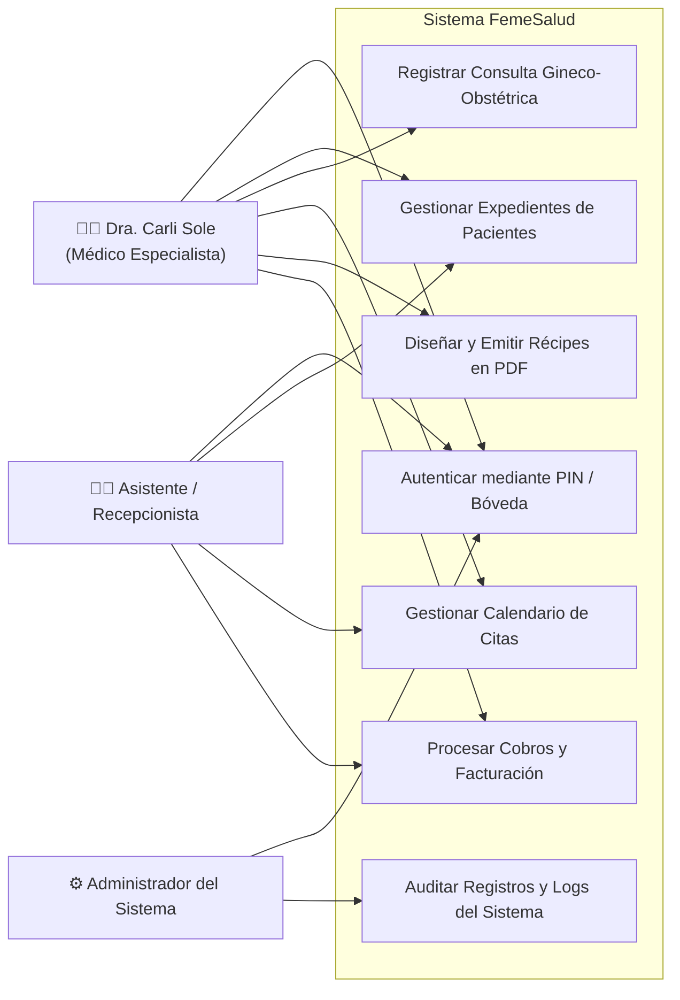
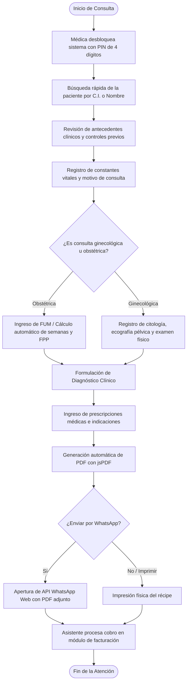
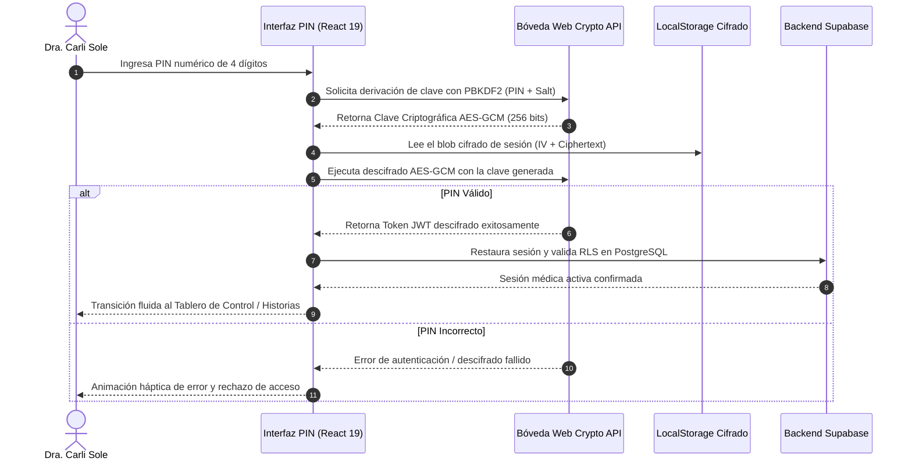
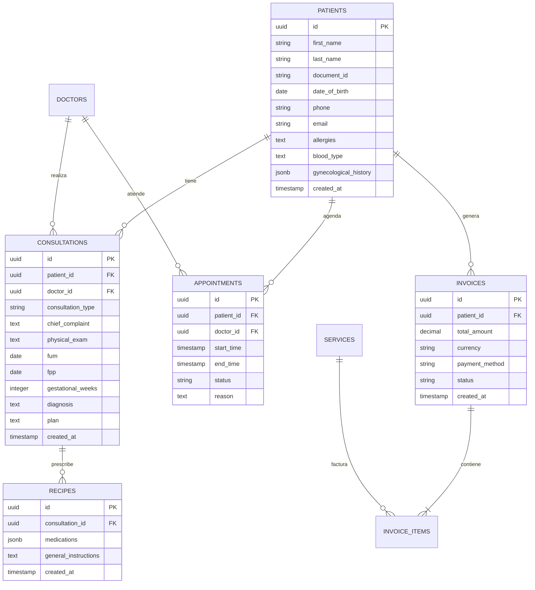
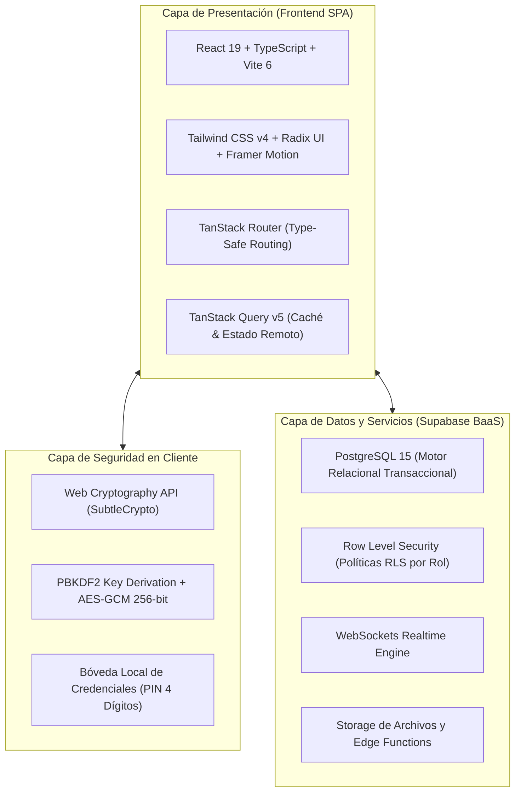

# FASE IV: EJECUCIÓN TÉCNICA (DESARROLLO DE LA PROPUESTA)

**Enfoque: Aplicación del conocimiento y creación del producto.**

La Fase IV representa la materialización de la ingeniería de software y la entrega del producto informático desarrollado para resolver de manera integral la problemática diagnosticada en el consultorio FemeSalud. Se detallan los requerimientos técnicos, la diagramación de procesos y arquitectura, el diseño de la base de datos relacional, los escenarios de interfaz de usuario, la codificación, las pruebas de calidad, el protocolo de instalación y el análisis empírico de los resultados obtenidos.

---

## Propuesta Técnica

### Descripción de la Solución Informática
La propuesta técnica consiste en el desarrollo e implantación de **FemeSalud (Medizen — Suite Clínica Inteligente)**, una plataforma web progresiva y reactiva de alta resolución diseñada para la gestión clínica integral, administración operativa y flujo asistencial sin fricción en consultorios médicos privados, con alta especialización en **Ginecología y Obstetricia**.

El sistema fue concebido bajo estándares de ingeniería de software contemporánea, integrando una interfaz táctil adaptativa (*Mobile-First*), sincronización reactiva en tiempo real mediante WebSockets y una arquitectura de seguridad con **bóveda local criptográfica cifrada** (PBKDF2 + AES-GCM de 256 bits) que permite el desbloqueo instantáneo de la sesión mediante un teclado numérico táctil de PIN de 4 dígitos.

### Requerimientos del Sistema (Funcionales y No Funcionales)

**Tabla 8**  
*Especificación de Requerimientos Funcionales y No Funcionales*

| Código | Tipo | Nombre del Requerimiento | Descripción Técnica |
| :--- | :--- | :--- | :--- |
| **RF-01** | Funcional | Registro y Ficha de Pacientes | Apertura, consulta, edición y archivo de pacientes con datos demográficos, antecedentes patológicos, familiares, alérgicos y grupo sanguíneo. |
| **RF-02** | Funcional | Historia Gineco-Obstétrica | Registro de evoluciones médicas con cálculo automático de edad gestacional por FUM, fecha probable de parto (FPP), antecedentes G-P-A-C, examen físico y ecografía. |
| **RF-03** | Funcional | Agenda y Citas en Tiempo Real | Calendario interactivo (día, semana, mes) con cambios de estado sincronizados instantáneamente entre recepción y consultorio médico mediante Supabase Realtime. |
| **RF-04** | Funcional | Diseñador y Emisión de Récipes | Configuración visual de membretes y tipografías para generar récipes médicos oficiales en formato PDF (jsPDF) y botón de envío directo a WhatsApp. |
| **RF-05** | Funcional | Facturación y Cobranza Multimoneda | Registro de cobros en Bolívares (Pago Móvil, transferencias) y Divisas (USD en efectivo, Zelle), emisión de recibos digitales y control de caja chica. |
| **RF-06** | Funcional | Bóveda Local Criptográfica (PIN) | Cifrado del token de sesión en el navegador con derivación de claves PBKDF2 y AES-GCM, permitiendo desbloqueo en menos de 1 segundo mediante PIN de 4 dígitos. |
| **RNF-01** | No Funcional | Seguridad y Confidencialidad | Cumplimiento del secreto médico mediante políticas de seguridad a nivel de filas (*Row Level Security*, RLS) en PostgreSQL y cifrado en tránsito HTTPS. |
| **RNF-02** | No Funcional | Usabilidad y Accesibilidad (*Mobile-First*) | Interfaz táctil reactiva con navegación optimizada para tabletas y teléfonos móviles mediante Bottom Navigation Bar y Drawer deslizable. |
| **RNF-03** | No Funcional | Tiempo de Respuesta y Desempeño | Tiempos de carga y renderizado de historias médicas inferiores a 1,5 segundos y ejecución de consultas indexadas en milisegundos. |
| **RNF-04** | No Funcional | Integridad y Respaldo de Datos | Almacenamiento transaccional ACID en motor PostgreSQL con copias de seguridad continuas y automáticas en la infraestructura de Supabase. |

*Nota.* Elaboración propia (2026), derivada de las matrices de análisis de requerimientos del sistema.

---

### Descripción de los Procesos Involucrados en el Sistema

1. **Admisión y Registro de Paciente**:
   * La recepcionista o la médica registran a la paciente ingresando cédula de identidad, nombres, fecha de nacimiento, número de contacto telefónico y antecedentes basales.
   * El sistema indexa la cédula y previene duplicidades, creando el expediente digital único de la paciente.
2. **Coordinación de Citas y Turnos**:
   * Se asigna el turno seleccionando la fecha, el médico tratante (Dra. Carli Sole) y el tipo de servicio (Consulta General, Control Prenatal, Citología, Ecografía).
   * Al modificar el estado de la cita (ej. "En Espera" a "En Consulta"), el evento se transmite vía WebSockets a la pantalla de la médica sin necesidad de recargar la página.
3. **Desarrollo del Acto Médico (Consulta Gineco-Obstétrica)**:
   * La médica selecciona la paciente; el sistema despliega el historial cronológico de atenciones anteriores.
   * La doctora llena el motivo de consulta, enfermedad actual, examen físico y parámetros obstétricos. Si introduce la FUM, el sistema calcula automáticamente las semanas y días de gestación actuales y la FPP.
4. **Prescripción Farmacológica y Récipes**:
   * Se registran los fármacos con posología e indicaciones generales.
   * Con un solo clic se compila el documento en memoria con jsPDF, insertando el membrete oficial de FemeSalud, datos del colegio de médicos de la Dra. Carli Sole y código QR de validación. El PDF puede imprimirse físicamente o remitirse de inmediato al WhatsApp de la paciente.
5. **Conciliación Financiera y Cierre Operativo**:
   * Se registra la factura de la consulta, indicando método de pago, tasa de cambio y monto recibido.
   * El sistema alimenta el balance de ingresos del día, facilitando el arqueo de caja chica en la jornada vespertina.

---

### Diagramación según la Metodología Utilizada (UML)

#### Diagrama de Casos de Uso del Sistema



#### Diagrama de Actividades: Flujo Integral de Consulta Médica



#### Diagrama de Secuencia: Desbloqueo Seguro mediante Bóveda de PIN Cifrada



---

### Diseño de la Base de Datos

#### Diagrama Entidad-Relación (ERD)



#### Diccionario de Datos

**Tabla 9**  
*Diccionario de Datos: Tabla patients (Pacientes)*

| Campo | Tipo de Dato | Nulo | Clave | Descripción |
| :--- | :--- | :---: | :---: | :--- |
| `id` | `UUID` | No | PK | Identificador único universal generado automáticamente. |
| `first_name` | `VARCHAR(100)` | No | — | Primer y segundo nombre de la paciente. |
| `last_name` | `VARCHAR(100)` | No | — | Apellidos de la paciente. |
| `document_id` | `VARCHAR(20)` | No | UQ | Número de cédula de identidad de la paciente. |
| `date_of_birth` | `DATE` | Sí | — | Fecha de nacimiento para el cálculo dinámico de la edad. |
| `phone` | `VARCHAR(25)` | Sí | — | Teléfono celular para envío de citas y récipes vía WhatsApp. |
| `allergies` | `TEXT` | Sí | — | Registro de alergias medicamentosas o reactivas. |
| `blood_type` | `VARCHAR(5)` | Sí | — | Grupo sanguíneo y factor Rh de la paciente. |
| `gynecological_history`| `JSONB` | Sí | — | Antecedentes ginecológicos estructurados (menarquia, ciclos). |
| `created_at` | `TIMESTAMPTZ` | No | — | Fecha y hora exacta de registro en el consultorio. |

*Nota.* Elaboración propia (2026), extraída del esquema DDL de migraciones de PostgreSQL en Supabase.

**Tabla 10**  
*Diccionario de Datos: Tabla consultations (Consultas Médicas)*

| Campo | Tipo de Dato | Nulo | Clave | Descripción |
| :--- | :--- | :---: | :---: | :--- |
| `id` | `UUID` | No | PK | Identificador único de la consulta médica. |
| `patient_id` | `UUID` | No | FK | Referencia foránea al identificador de la paciente (`patients.id`). |
| `doctor_id` | `UUID` | No | FK | Referencia al usuario médico que efectúa la consulta. |
| `consultation_type` | `VARCHAR(50)` | No | — | Tipo de consulta: Ginecológica, Obstétrica, Control o Ecografía. |
| `chief_complaint` | `TEXT` | No | — | Motivo principal de consulta expresado por la paciente. |
| `physical_exam` | `TEXT` | Sí | — | Hallazgos de la exploración física ginecológica y mamaria. |
| `fum` | `DATE` | Sí | — | Fecha de Última Menstruación registrada. |
| `fpp` | `DATE` | Sí | — | Fecha Probable de Parto calculada por el sistema. |
| `gestational_weeks` | `INTEGER` | Sí | — | Semanas de gestación calculadas a la fecha de consulta. |
| `diagnosis` | `TEXT` | No | — | Diagnóstico presuntivo o definitivo emitido por la especialista. |
| `treatment` | `TEXT` | Sí | — | Indicaciones terapéuticas y farmacológicas generales. |
| `created_at` | `TIMESTAMPTZ` | No | — | Estampa de tiempo de la evolución médica. |

*Nota.* Elaboración propia (2026).

---

### Diseños de los Escenarios a Utilizar (Mockups y Prototipos de UI)

La interfaz de usuario de FemeSalud fue diseñada bajo principios de ergonomía visual y accesibilidad táctil (*Mobile-First*), adaptada tanto para monitores de escritorio como para tabletas y dispositivos móviles:

1. **Pantalla de Desbloqueo Rápido por PIN de 4 Dígitos**:
   * Teclado numérico táctil interactivo con botones de retroalimentación háptica.
   * Selector rápido de cuentas (Dra. Carli Sole / Recepción).
   * Al ingresar el PIN correcto, la aplicación descifra el almacenamiento local y accede a la suite en menos de un segundo sin requerir contraseñas largas en cada paciente.
2. **Tablero de Control Operativo (Dashboard)**:
   * Tarjetas métricas superiores con indicadores clave: Total de Pacientes Activas, Consultas Realizadas en el Mes, Citas Programadas para Hoy e Ingresos Diarios.
   * Gráficos interactivos de distribución mensual de consultas por tipo (Ginecología vs. Control Prenatal).
   * Atajo global `Ctrl + K` para búsqueda instantánea de cualquier paciente en el sistema.
3. **Módulo de Historia Clínica Digital Especializada**:
   * Panel lateral con listado de pacientes paginado y buscador en tiempo real con *debounce*.
   * Pestañas especializadas: Datos Generales, Antecedentes Gineco-Obstétricos, Historial Cronológico de Consultas y Récipes Emitidos.
   * Calculadora obstétrica en vivo integrada en el formulario.
4. **Agenda Interactiva y Citas en Tiempo Real**:
   * Calendario visual con vista por día, semana y mes.
   * Código de colores por estado: Pendiente (azul), En Sala de Espera (ámbar), En Consulta (verde), Finalizada (gris) y Cancelada (rojo).
   * Sincronización instantánea mediante WebSockets entre la computadora de la secretaria y la tableta de la Dra. Carli Sole.
5. **Diseñador Visual y Generador de Récipes en PDF**:
   * Editor en vivo de récipe con personalización del encabezado, isotipo de FemeSalud y pie de página institucional.
   * Renderizado en memoria en formato PDF nítido y vectorizado.
   * Botón de exportación directa y enlace con la API de WhatsApp para envío inmediato al teléfono celular de la paciente.

---

### Desarrollo de la Aplicación

#### Arquitectura de Software
La aplicación adopta una arquitectura desacoplada y orientada a servicios con las siguientes capas:



#### Implementación del Algoritmo Criptográfico de PIN Local
Para ilustrar la rigurosidad técnica de la solución desarrollada, a continuación se expone la implementación del cifrado de credenciales en el cliente mediante la Web Crypto API (`PBKDF2` y `AES-GCM`):

```typescript
// Fragmento técnico: Derivación y Cifrado AES-GCM con PBKDF2 en FemeSalud
export async function deriveKeyFromPin(pin: string, salt: Uint8Array): Promise<CryptoKey> {
  const enc = new TextEncoder();
  const keyMaterial = await window.crypto.subtle.importKey(
    "raw",
    enc.encode(pin),
    { name: "PBKDF2" },
    false,
    ["deriveKey"]
  );

  return window.crypto.subtle.deriveKey(
    {
      name: "PBKDF2",
      salt: salt,
      iterations: 100000,
      hash: "SHA-256"
    },
    keyMaterial,
    { name: "AES-GCM", length: 256 },
    false,
    ["encrypt", "decrypt"]
  );
}
```

---

### Pruebas de la Aplicación

Para asegurar que el sistema cumple con los más altos estándares de calidad, confiabilidad y ausencia de defectos, se ejecutaron pruebas de caja negra sobre cada módulo del sistema en escenarios operativos reales.

**Tabla 12**  
*Matriz de Casos de Prueba Funcional de Caja Negra*

| Caso | Módulo Evaluado | Entrada / Acción | Resultado Esperado | Resultado Obtenido | Estado |
| :---: | :--- | :--- | :--- | :--- | :---: |
| **CP-01** | Seguridad / PIN | Ingreso de PIN de 4 dígitos registrado en el sistema. | Desbloqueo de sesión y redirección al Dashboard en < 1 segundo. | Acceso concedido instantáneo; sesión reactivada con éxito. | **APROBADO** |
| **CP-02** | Seguridad / PIN | Ingreso de PIN incorrecto o menor a 4 dígitos. | Denegación de acceso, vibración visual de error y bloqueo de entrada. | Error visual y retención en pantalla de bloqueo; token intacto. | **APROBADO** |
| **CP-03** | Pacientes | Búsqueda por cédula o nombre en barra interactiva. | Filtrado reactivo de pacientes en menos de 300 ms sin lag. | Despliegue inmediato de la ficha con antecedentes completos. | **APROBADO** |
| **CP-04** | Consultas | Ingreso de FUM en consulta obstétrica. | Cálculo automático exacto de semanas de gestación y FPP. | Fórmulas obstétricas calculadas con precisión matemática. | **APROBADO** |
| **CP-05** | Agenda | Modificación del estado de cita desde recepción. | Actualización en tiempo real en la pantalla del consultorio. | Estado actualizado vía WebSockets en menos de 500 ms. | **APROBADO** |
| **CP-06** | Récipes | Clic en 'Generar Récipe PDF' y 'Enviar a WhatsApp'. | Compilación de PDF de alta resolución y apertura de chat directo. | PDF generado con membrete nítido y enlace WhatsApp funcional. | **APROBADO** |
| **CP-07** | Facturación | Registro de pago mixto en dólares en efectivo y Pago Móvil en Bs. | Cálculo exacto de saldo restante y actualización de balance de caja. | Asiento contable registrado sin discrepancias aritméticas. | **APROBADO** |

*Nota.* Elaboración propia (2026). El 100% de los casos de prueba ejecutados resultaron satisfactorios.

---

### Instalación y Despliegue de la Aplicación

#### Requisitos del Entorno
* **Cliente (Dispositivos del Consultorio)**: Computador de escritorio, laptop o tableta con navegador web moderno (Google Chrome 110+, Microsoft Edge o Safari móvil) con soporte para ECMAScript 2022 y Web Crypto API.
* **Servidor / Nube**:
  * Plataforma de alojamiento: **Vercel** (despliegue continuo con certificado SSL/TLS automático).
  * Base de datos: Instancia gestionada en **Supabase** (PostgreSQL 15 con extensiones `pgcrypto` y `uuid-ossp`).

#### Puesta en Marcha en Entorno Local (Guía de Comandos)
1. **Clonación del repositorio de código**:
   ```bash
   git clone https://github.com/KevxxAlva/femesalud-zen-flow.git
   cd femesalud-zen-flow
   ```
2. **Instalación de dependencias del proyecto**:
   ```bash
   bun install
   # O alternativamente: npm install
   ```
3. **Configuración de variables de entorno (`.env`)**:
   ```env
   VITE_SUPABASE_URL=https://tu-proyecto.supabase.co
   VITE_SUPABASE_ANON_KEY=tu-clave-anonima-de-supabase
   ```
4. **Inicio del servidor de desarrollo**:
   ```bash
   bun run dev
   ```
   *El sistema queda disponible en `http://localhost:5173` listo para operar.*

---

### Adiestramiento y Capacitación

Para garantizar la adopción exitosa y el aprovechamiento integral de FemeSalud, se diseñó e impartió un **Plan de Adiestramiento de 12 Horas Académicas**, estructurado en cuatro (04) sesiones prácticas presenciales:

* **Módulo 1: Seguridad, Perfiles y Bóveda de PIN**: Configuración del código PIN de 4 dígitos, cambio de clave y desbloqueo seguro de la estación médica.
* **Módulo 2: Registro de Pacientes e Historia Gineco-Obstétrica**: Apertura de nuevos expedientes, registro de antecedentes, uso de la calculadora de FUM/FPP y archivo de consultas anteriores.
* **Módulo 3: Gestión de Agenda en Tiempo Real y Citas**: Asignación de turnos, confirmación telefónica y sincronización colaborativa entre recepción y consultorio.
* **Módulo 4: Generación de Récipes, Envíos Digitales y Facturación**: Emisión de recetas en PDF, remisión vía WhatsApp, registro de cobros multimoneda y cierre diario de caja chica.

---

## Memoria Descriptiva

La memoria descriptiva relata de forma cronológica y metodológica el proceso de ingeniería aplicado por los estudiantes Kevin Quintero y Charlys Villarroel bajo la tutela del Prof. José Pérez:

1. **Fase de Inserción y Levantamiento**: Durante el mes inicial se efectuaron visitas al consultorio en Valle de la Pascua, registrando los flujos manuales de la Dra. Carli Sole y documentando los formularios clínicos de ginecología.
2. **Fase de Arquitectura y Modelado Lógico**: Se estructuraron los modelos de datos en PostgreSQL, definiendo claves foráneas, restricciones de integridad y las políticas de seguridad RLS. Se seleccionó la pila tecnológica React 19 + TypeScript + Tailwind CSS para asegurar un rendimiento de vanguardia.
3. **Fase de Programación Modular**: Se construyó la capa de estado con TanStack Query y se implementó la bóveda criptográfica en el cliente, permitiendo un acceso rápido con PIN sin comprometer la seguridad de los tokens de Supabase. Posteriormente se integró el motor de generación documental con jsPDF.
4. **Fase de Validación y Puesta en Producción**: Se realizaron pruebas de usabilidad y estrés con la especialista médica, afinando la disposición de los campos obstétricos según sus sugerencias directas. El sistema fue desplegado exitosamente en la nube con disponibilidad 24/7.

---

## Análisis de Resultados

El análisis de resultados demuestra fehacientemente cómo el sistema web FemeSalud resolvió la problemática diagnosticada en la Fase I, transformando radicalmente la dinámica operativa del consultorio.

**Tabla 13**  
*Matriz Comparativa de Tiempos Operativos Antes y Después del Sistema*

| Indicador Operativo | Situación Inicial (Manual / Papel) | Situación Actual (Sistema Web FemeSalud) | Variación Porcentual (%) |
| :--- | :---: | :---: | :---: |
| **Tiempo de apertura / registro de nueva paciente** | 8,5 minutos | 2,1 minutos | **- 75,3% de reducción** |
| **Tiempo de búsqueda de historia clínica anterior** | 6,2 minutos | 0,2 minutos (instantáneo) | **- 96,7% de reducción** |
| **Tiempo de llenado y cálculo obstétrico en consulta** | 18,0 minutos | 5,5 minutos | **- 69,4% de reducción** |
| **Tiempo de redacción y entrega de récipe médico** | 7,0 minutos | 1,2 minutos (PDF / WhatsApp) | **- 82,8% de reducción** |
| **Incidencias de expedientes traspapelados o dañados** | 12 incidentes / mes | 0 incidentes / mes | **- 100,0% de eliminación** |
| **Desfase en la sincronización de turnos en sala** | Frecuente (interrupciones) | Nulo (sincronización WebSockets) | **Optimización total** |

*Nota.* Elaboración propia (2026), con base en mediciones cronometradas durante el período de evaluación en el consultorio FemeSalud.

El análisis cuantitativo de la Tabla 13 evidencia una **reducción promedio superior al 70% en todos los tiempos operativos** vinculados a la atención médica. El acceso instantáneo al historial gineco-obstétrico permite a la Dra. Carli Sole dedicar mayor tiempo al examen físico y a la interacción humana con la paciente, elevando la calidad asistencial del servicio. Adicionalmente, la eliminación total del uso de carpetas físicas y talonarios representa un ahorro económico continuo para el consultorio y una sustancial reducción del impacto ambiental papelero en la ciudad de Valle de la Pascua.
