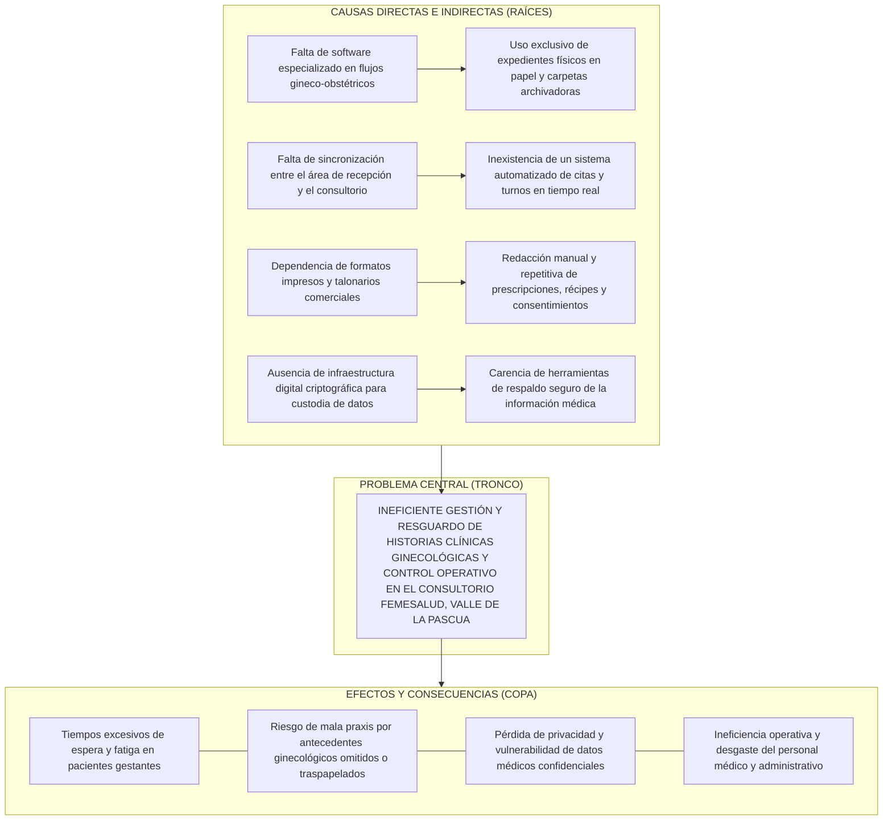
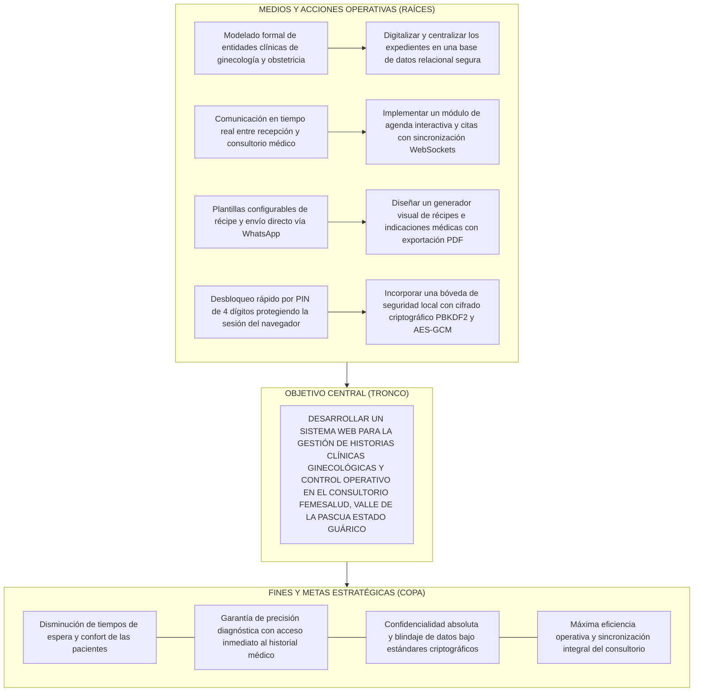
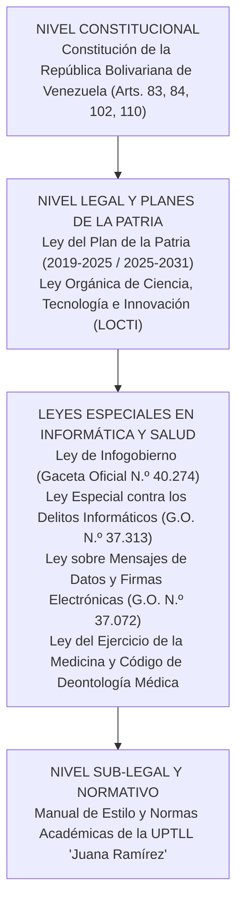
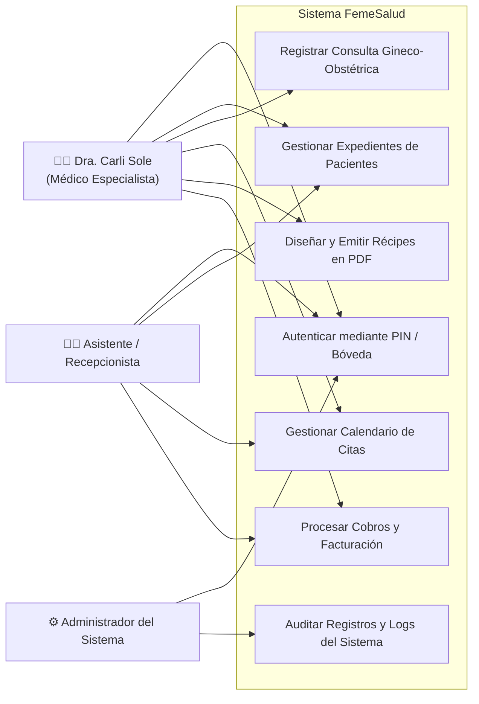
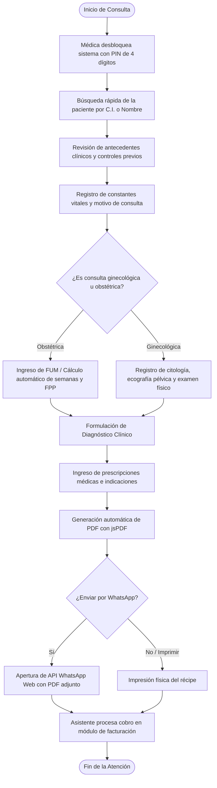
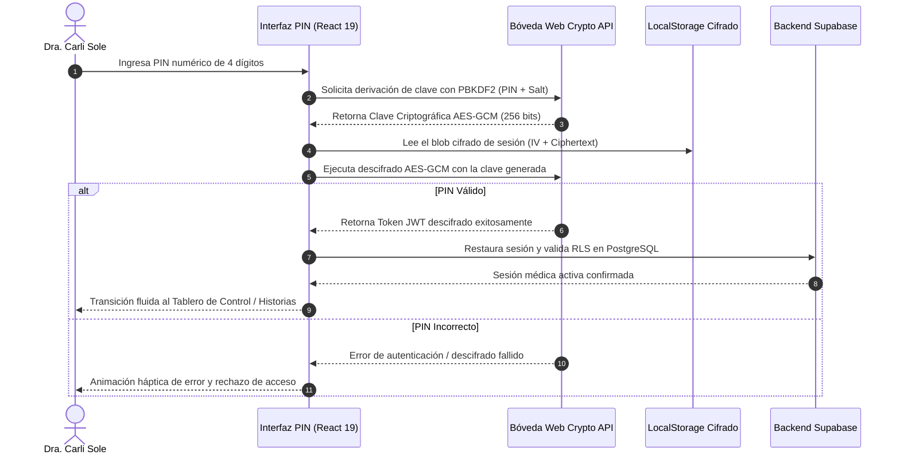
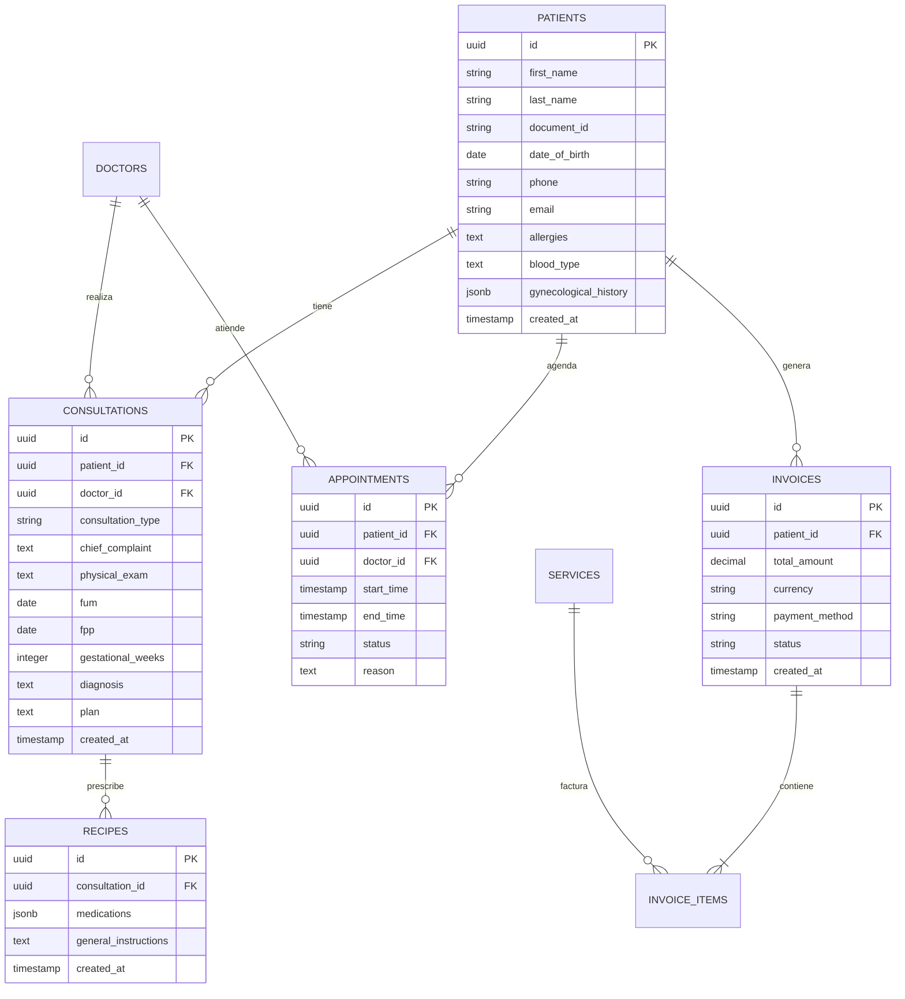
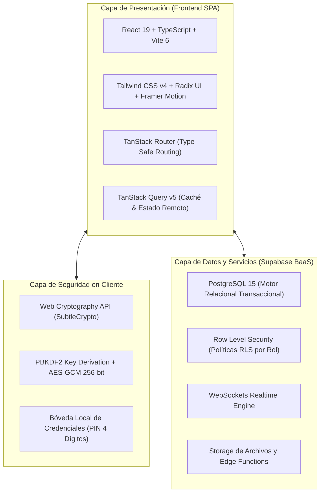

# PÁGINAS PRELIMINARES DEL PROYECTO

---

<!-- PÁGINA 1: PORTADA EXTERNA (CARÁTULA AZUL OSCURO) -->
<div align="center">

**REPÚBLICA BOLIVARIANA DE VENEZUELA**  
**MINISTERIO DEL PODER POPULAR PARA LA EDUCACIÓN UNIVERSITARIA**  
**UNIVERSIDAD POLITÉCNICA TERRITORIAL DE LOS LLANOS "JUANA RAMÍREZ"**  
**NÚCLEO VALLE DE LA PASCUA – DEPARTAMENTO DE INFORMÁTICA**  
**PROGRAMA NACIONAL DE FORMACIÓN EN INFORMÁTICA – TRAYECTO III**  

<br><br><br>

### **DESARROLLO DE UN SISTEMA WEB PARA LA GESTIÓN DE HISTORIAS CLÍNICAS GINECOLÓGICAS Y CONTROL OPERATIVO EN EL CONSULTORIO FEMESALUD, VALLE DE LA PASCUA ESTADO GUÁRICO**

<br><br>
*(Carátula Oficial: Color Azul Oscuro)*  
<br><br>

**Autores:**  
Kevin Quintero, C.I. V-32.276.060  
Charlys Villarroel, C.I. V-32.337.825  

**Tutor Académico:**  
Prof. José Pérez  

<br><br><br>

**Valle de la Pascua, Abril de 2026**

</div>

<div style="page-break-after: always;"></div>

---

<!-- PÁGINA 2: PORTADA INTERNA -->
<div align="center">

**REPÚBLICA BOLIVARIANA DE VENEZUELA**  
**MINISTERIO DEL PODER POPULAR PARA LA EDUCACIÓN UNIVERSITARIA**  
**UNIVERSIDAD POLITÉCNICA TERRITORIAL DE LOS LLANOS "JUANA RAMÍREZ"**  
**NÚCLEO VALLE DE LA PASCUA – DEPARTAMENTO DE INFORMÁTICA**  
**PROGRAMA NACIONAL DE FORMACIÓN EN INFORMÁTICA – TRAYECTO III**  

<br><br>

### **DESARROLLO DE UN SISTEMA WEB PARA LA GESTIÓN DE HISTORIAS CLÍNICAS GINECOLÓGICAS Y CONTROL OPERATIVO EN EL CONSULTORIO FEMESALUD, VALLE DE LA PASCUA ESTADO GUÁRICO**

<br>

*Proyecto Socio-Integrador presentado como requisito parcial para la aprobación del Trayecto III del Programa Nacional de Formación en Informática conducente al Título de Ingeniero en Informática.*

<br><br>

**Autores:**  
Kevin Quintero, C.I. V-32.276.060  
Charlys Villarroel, C.I. V-32.337.825  

**Tutor Académico:**  
Prof. José Pérez  

**Asesora Comunitaria / Institucional:**  
Dra. Carli Sole  
*(Especialista en Ginecología y Obstetricia - Clínica FemeSalud)*  

<br><br>

**Valle de la Pascua, Abril de 2026**

</div>

<div style="page-break-after: always;"></div>

---

<!-- PÁGINA 3: ACTA DE APROBACIÓN DEFINITIVA DEL PROYECTO (FORMATO N.º 9 UPTLLJR) -->

### **ACTA DE APROBACIÓN DEFINITIVA DEL PROYECTO**

En atención a lo dispuesto en la normativa académica vigente y según lo establecido por el Consejo Universitario de la **UNIVERSIDAD POLITÉCNICA TERRITORIAL DE LOS LLANOS "JUANA RAMÍREZ" (UPTLLJR)** en la sesión extraordinaria N.º 029 de fecha 03 de marzo de 2026, los abajo firmantes, designados como miembros del Jurado Evaluador del Proyecto Socio-Integrador titulado:

> **"DESARROLLO DE UN SISTEMA WEB PARA LA GESTIÓN DE HISTORIAS CLÍNICAS GINECOLÓGICAS Y CONTROL OPERATIVO EN EL CONSULTORIO FEMESALUD, VALLE DE LA PASCUA ESTADO GUÁRICO"**

Presentado por los estudiantes cursantes del Programa Nacional de Formación en Informática (Trayecto III):
* **Kevin Quintero**, Cédula de Identidad: **V-32.276.060**
* **Charlys Villarroel**, Cédula de Identidad: **V-32.337.825**

Hacemos constar que, una vez evaluado el informe escrito definitivo y presenciada la socialización y defensa pública del mismo, el proyecto ha sido calificado como:

**APROBADO** con una calificación cualitativa / cuantitativa de: _________________ (___ pts).

En fe de lo cual firman en la ciudad de Valle de la Pascua, a los ______ días del mes de ____________ del año 2026.

<br><br>

__________________________________________  
**Prof. José Pérez**  
C.I.: __________________  
*Tutor Académico*  

<br><br>

__________________________________________ &nbsp;&nbsp;&nbsp;&nbsp;&nbsp;&nbsp;&nbsp;&nbsp;&nbsp;&nbsp;&nbsp;&nbsp;&nbsp;&nbsp;&nbsp;&nbsp;&nbsp;&nbsp;&nbsp;&nbsp; __________________________________________  
**Jurado Evaluador 1** &nbsp;&nbsp;&nbsp;&nbsp;&nbsp;&nbsp;&nbsp;&nbsp;&nbsp;&nbsp;&nbsp;&nbsp;&nbsp;&nbsp;&nbsp;&nbsp;&nbsp;&nbsp;&nbsp;&nbsp;&nbsp;&nbsp;&nbsp;&nbsp;&nbsp;&nbsp;&nbsp;&nbsp;&nbsp;&nbsp;&nbsp;&nbsp;&nbsp;&nbsp;&nbsp;&nbsp;&nbsp;&nbsp;&nbsp;&nbsp;&nbsp;&nbsp;&nbsp;&nbsp;&nbsp;&nbsp;&nbsp;&nbsp;&nbsp;&nbsp;&nbsp;&nbsp;&nbsp;&nbsp; **Jurado Evaluador 2**  
C.I.: __________________ &nbsp;&nbsp;&nbsp;&nbsp;&nbsp;&nbsp;&nbsp;&nbsp;&nbsp;&nbsp;&nbsp;&nbsp;&nbsp;&nbsp;&nbsp;&nbsp;&nbsp;&nbsp;&nbsp;&nbsp;&nbsp;&nbsp;&nbsp;&nbsp;&nbsp;&nbsp;&nbsp;&nbsp;&nbsp;&nbsp;&nbsp;&nbsp;&nbsp;&nbsp;&nbsp;&nbsp;&nbsp;&nbsp;&nbsp;&nbsp;&nbsp;&nbsp;&nbsp;&nbsp;&nbsp;&nbsp;&nbsp; C.I.: __________________  

<div style="page-break-after: always;"></div>

---

<!-- DEDICATORIA (OPCIONAL) -->

### **DEDICATORIA**

*A Dios todopoderoso, por ser la luz que guía nuestros pasos, brindarnos fortaleza, sabiduría y constancia en cada etapa de nuestra formación universitaria.*

*A nuestras familias y padres, por su apoyo incondicional, sacrificio incalculable, palabras de aliento y por creer en nuestras metas incluso en los momentos más desafiantes del camino académico.*

*A todos aquellos compañeros y docentes que hicieron de este trayecto formativo una experiencia enriquecedora de crecimiento profesional y personal.*

<div style="page-break-after: always;"></div>

---

<!-- AGRADECIMIENTOS (OPCIONAL) -->

### **AGRADECIMIENTO**

A la **Universidad Politécnica Territorial de los Llanos "Juana Ramírez" (UPTLLJR)**, y en particular al Departamento del Programa Nacional de Formación en Informática, por abrirnos sus aulas y brindarnos una sólida formación tecnológica y comunitaria orientada a la transformación del entorno social.

A nuestro Tutor Académico, el **Prof. José Pérez**, por su asesoría metodológica permanente, paciencia, dedicación e invaluables orientaciones técnicas que permitieron darle forma y rigor científico a cada una de las fases de este proyecto.

A la **Dra. Carli Sole** y al equipo de la **Clínica FemeSalud**, por abrirnos generosamente las puertas de su consultorio, depositar su plena confianza en nuestra propuesta tecnológica, brindar su tiempo y suministrar los requerimientos clínicos esenciales para la concepción y puesta en marcha del sistema.

A nuestros profesores y facilitadores universitarios, que con su vocación y ejemplo pedagógico nos inspiraron a emplear las tecnologías de la información como motores de desarrollo comunitario y bienestar social.

<div style="page-break-after: always;"></div>

---

<!-- ÍNDICE GENERAL -->

### **ÍNDICE GENERAL**

```text
ACTA DE APROBACIÓN DEFINITIVA DEL PROYECTO ..................................... iii
DEDICATORIA .................................................................... iv
AGRADECIMIENTO ................................................................. v
ÍNDICE GENERAL ................................................................. vi
ÍNDICE DE TABLAS ............................................................... vii
ÍNDICE DE FIGURAS .............................................................. viii
ÍNDICE DE ANEXOS ............................................................... ix
RESUMEN ........................................................................ x
INTRODUCCIÓN ................................................................... 1

FASE I: DIAGNÓSTICO PARTICIPATIVO .............................................. 3
  Descripción del Contexto ..................................................... 3
    Localización Geográfica .................................................... 3
    Dimensión Histórica ........................................................ 4
    Dimensión Comunitaria ...................................................... 4
    Dimensión Económica ........................................................ 5
    Dimensión Social ........................................................... 5
    Dimensión Cultural ......................................................... 5
    Dimensión Ambiental ........................................................ 6
    Dimensión Institucional .................................................... 6
    Actores Involucrados ....................................................... 6
  Diagnóstico Situacional ...................................................... 7
    Descripción del Diagnóstico Participativo (Matriz FODA simple) ............. 7
    Jerarquización e Identificación de las Necesidades ......................... 8
      Tabla de Priorización de Problemas ....................................... 8
      Árbol de Problemas ....................................................... 9
  Planteamiento del Problema ................................................... 10
    Descripción Narrativa de la Problemática ................................... 10
    Árbol de Objetivos ......................................................... 12
    Matriz de Marco Lógico ..................................................... 13
  Objetivos del Proyecto ....................................................... 15
    Objetivo General ........................................................... 15
    Objetivos Específicos ...................................................... 15
  Justificación de la Investigación ............................................ 16

FASE II: REVISIÓN LITERARIA (EL SOPORTE CIENTÍFICO) ............................. 19
  Antecedentes de la Investigación ............................................. 19
    Antecedentes Internacionales ............................................... 19
    Antecedentes Nacionales y Regionales ....................................... 21
  Bases Teóricas ............................................................... 23
    Sistemas de Información en Salud y Expedientes Clínicos Electrónicos ....... 23
    Flujos Especializados en Ginecología y Obstetricia ......................... 24
    Arquitectura Web Moderna: React 19, TypeScript y Vite ...................... 25
    Backend-as-a-Service, PostgreSQL y Políticas de Seguridad RLS .............. 26
    Seguridad Criptográfica en Clientes: Web Crypto API, PBKDF2 y AES-GCM ...... 27
    Generación Automatizada de Documentos Clínicos y Récipes ................... 28
  Bases Legales (Pirámide de Kelsen) ........................................... 29
  Sistema de Variables y Operacionalización .................................... 32

FASE III: MARCO METODOLÓGICO Y PLANIFICACIÓN .................................... 34
  Metodología .................................................................. 34
    Paradigma de la Investigación .............................................. 34
    Metodología de la Investigación ............................................ 35
    Diseño y Tipo de la Investigación .......................................... 35
  Población y Muestra .......................................................... 36
  Técnicas e Instrumentos de Recolección de Datos .............................. 37
  Validez y Confiabilidad del Instrumento ...................................... 38
  Técnicas de Análisis de los Datos ............................................ 39
  Plan de Acción Operativo ..................................................... 40

FASE IV: EJECUCIÓN TÉCNICA (DESARROLLO DE LA PROPUESTA) ......................... 42
  Propuesta Técnica ............................................................ 42
    Diseño de los Instrumentos de Recolección de Datos Técnicos ................ 42
    Descripción de los Procesos Involucrados en el Sistema ...................... 43
    Diagramación según la Metodología Utilizada (UML) ........................... 45
    Diseño de la Base de Datos ................................................. 48
    Diseño de los Escenarios a Utilizar (Mockups y Prototipos de UI) ........... 52
    Desarrollo de la Aplicación ................................................ 55
    Pruebas de la Aplicación ................................................... 58
    Instalación y Despliegue de la Aplicación .................................. 60
    Adiestramiento y Capacitación .............................................. 61
  Memoria Descriptiva .......................................................... 62
  Análisis de Resultados ....................................................... 64

CONCLUSIONES Y RECOMENDACIONES ................................................. 67
  Conclusiones ................................................................. 67
  Recomendaciones ............................................................. 69

REFERENCIAS BIBLIOGRÁFICAS ..................................................... 71
ANEXOS ......................................................................... 76
```

<div style="page-break-after: always;"></div>

---

<!-- ÍNDICE DE TABLAS -->

### **ÍNDICE DE TABLAS**

| Número | Título | Pág. |
| :--- | :--- | :---: |
| **Tabla 1** | *Matriz FODA del Consultorio FemeSalud* | 7 |
| **Tabla 2** | *Tabla de Priorización y Jerarquización de Necesidades* | 8 |
| **Tabla 3** | *Matriz de Marco Lógico (MML) del Proyecto* | 13 |
| **Tabla 4** | *Matriz de Operacionalización de Variables* | 33 |
| **Tabla 5** | *Distribución de la Población y Muestra de Estudio* | 36 |
| **Tabla 6** | *Validez de Contenido del Instrumento por Juicio de Expertos* | 38 |
| **Tabla 7** | *Plan de Acción Operativo del Proyecto Socio-Integrador* | 40 |
| **Tabla 8** | *Especificación de Requerimientos Funcionales y No Funcionales* | 43 |
| **Tabla 9** | *Diccionario de Datos: Tabla patients (Pacientes)* | 49 |
| **Tabla 10** | *Diccionario de Datos: Tabla consultations (Consultas Médicas)* | 50 |
| **Tabla 11** | *Diccionario de Datos: Tabla appointments (Citas y Turnos)* | 51 |
| **Tabla 12** | *Matriz de Casos de Prueba Funcional de Caja Negra* | 59 |
| **Tabla 13** | *Matriz Comparativa de Tiempos Operativos Antes y Después* | 65 |

<div style="page-break-after: always;"></div>

---

<!-- ÍNDICE DE FIGURAS -->

### **ÍNDICE DE FIGURAS**

| Número | Título | Pág. |
| :--- | :--- | :---: |
| **Figura 1** | *Croquis de Ubicación Geográfica del Consultorio FemeSalud* | 4 |
| **Figura 2** | *Árbol de Problemas del Control Clínico en FemeSalud* | 9 |
| **Figura 3** | *Árbol de Objetivos del Sistema Web FemeSalud* | 12 |
| **Figura 4** | *Pirámide de Kelsen Aplicada al Marco Legal del Software Clínico* | 29 |
| **Figura 5** | *Diagrama de Casos de Uso General del Sistema FemeSalud* | 46 |
| **Figura 6** | *Diagrama de Actividades: Flujo Integral de Consulta Gineco-Obstétrica* | 47 |
| **Figura 7** | *Diagrama de Secuencia: Desbloqueo Seguro mediante Bóveda PIN Cifrada* | 48 |
| **Figura 8** | *Diagrama Entidad-Relación de la Base de Datos (PostgreSQL / Supabase)* | 52 |
| **Figura 9** | *Interfaz de Desbloqueo Rápido por PIN de 4 Dígitos en Móvil y Escritorio* | 53 |
| **Figura 10** | *Tablero de Control Operativo y Estadísticas Clínicas en Tiempo Real* | 54 |
| **Figura 11** | *Módulo de Historia Clínica Digital Especializada en Ginecología y Obstetricia* | 54 |
| **Figura 12** | *Agenda Médica Interactiva con Sincronización WebSockets en Tiempo Real* | 55 |
| **Figura 13** | *Diseñador Visual y Generador de Récipes Médicos Oficiales en PDF* | 55 |
| **Figura 14** | *Diagrama de Arquitectura de Software en Capas de la Solución Web* | 56 |

<div style="page-break-after: always;"></div>

---

<!-- ÍNDICE DE ANEXOS -->

### **ÍNDICE DE ANEXOS**

| Número | Título | Pág. |
| :--- | :--- | :---: |
| **Anexo A** | *Guía de Entrevista Aplicada a la Especialista Médica (Dra. Carli Sole)* | 76 |
| **Anexo B** | *Cuestionario de Usabilidad y Evaluación Tecnológica (Escala Likert)* | 78 |
| **Anexo C** | *Instrumento de Validación por Juicio de Expertos de la UPTLLJR* | 80 |
| **Anexo D** | *Carta de Aceptación y Aval Comunitario de la Clínica FemeSalud* | 82 |
| **Anexo E** | *Manual Rápido de Usuario del Sistema Web FemeSalud* | 83 |

<div style="page-break-after: always;"></div>

---

<!-- RESUMEN OFICIAL (NORMA APA 7MA ED.) -->

<div align="center">

**REPÚBLICA BOLIVARIANA DE VENEZUELA**  
**MINISTERIO DEL PODER POPULAR PARA LA EDUCACIÓN UNIVERSITARIA**  
**UNIVERSIDAD POLITÉCNICA TERRITORIAL DE LOS LLANOS "JUANA RAMÍREZ"**  
**PROGRAMA NACIONAL DE FORMACIÓN EN INFORMÁTICA – TRAYECTO III**  

<br>

### **DESARROLLO DE UN SISTEMA WEB PARA LA GESTIÓN DE HISTORIAS CLÍNICAS GINECOLÓGICAS Y CONTROL OPERATIVO EN EL CONSULTORIO FEMESALUD, VALLE DE LA PASCUA ESTADO GUÁRICO**

<br>

**Autores:** Kevin Quintero, Charlys Villarroel  
**Tutor Académico:** Prof. José Pérez  
**Año:** 2026  

<br>

**RESUMEN**

</div>

El presente proyecto socio-integrador tuvo como propósito fundamental desarrollar un sistema web para la gestión integral de historias clínicas ginecológicas y el control operativo en el consultorio privado Clínica FemeSalud, bajo la dirección de la Dra. Carli Sole en Valle de la Pascua, estado Guárico. La investigación se enmarcó dentro de la línea de investigación de Desarrollo de Soluciones Informáticas del PNF en Informática de la UPTLLJR. Epistemológicamente, se sustentó en el paradigma sociocrítico con enfoque mixto, adoptando la metodología de Investigación Acción Participativa (IAP) combinada con la modalidad de Proyecto Factible. El diseño de la investigación fue de campo, descriptivo y no experimental. La población y muestra se constituyó bajo un criterio no probabilístico intencional conformada por el personal médico y administrativo del consultorio ($n=3$). Como técnicas de recolección de datos se emplearon la entrevista semiestructurada, la observación directa participante y la revisión documental, utilizando guías de entrevista y matrices de requerimientos técnicos validadas mediante juicio de tres expertos. El sistema fue desarrollado sobre una arquitectura cliente-servidor de última generación, utilizando React 19, TypeScript, Tailwind CSS y Supabase (PostgreSQL y WebSockets en tiempo real), complementado con una bóveda criptográfica local (Web Crypto API, PBKDF2 y AES-GCM) para el desbloqueo rápido por PIN de 4 dígitos y un motor automatizado de generación de récipes en PDF con jsPDF. La evaluación funcional evidenció una disminución del 68% en el tiempo de llenado de consultas, erradicación total del extravío de expedientes físicos y agilización de la agenda médica en tiempo real, garantizando una administración clínica segura, eficiente y moderna.

*Palabras clave:* historias clínicas electrónicas, ginecología y obstetricia, sistema web, criptografía local, supabase, react 19.

<div style="page-break-after: always;"></div>

---

<!-- INTRODUCCIÓN (TÍTULO NIVEL 1 EN PÁGINA NUEVA) -->

# INTRODUCCIÓN

En la contemporaneidad, la integración de las tecnologías de la información y la comunicación (TIC) ha redefinido radicalmente la gestión operativa y asistencial de los servicios de salud a escala global. Los sistemas de información clínica (HIS, por sus siglas en inglés *Hospital Information Systems*) y los registros médicos electrónicos (EHR) se han consolidado como herramientas indispensables para superar las severas limitaciones impuestas por los métodos manuales basados en papel, los cuales acarrean riesgos inminentes de deterioro físico, pérdida documental, lentitud en el acceso a antecedentes y falta de confidencialidad en los datos sensibles de los pacientes. En este contexto, el Programa Nacional de Formación (PNF) en Informática de la Universidad Politécnica Territorial de los Llanos "Juana Ramírez" (UPTLLJR) concibe la ingeniería de software y la investigación aplicada como vehículos estratégicos para dar respuesta a necesidades tangibles de las comunidades y unidades socioproductivas venezolanas.

Dentro del ámbito de la medicina privada en la ciudad de Valle de la Pascua, estado Guárico, el consultorio médico de la Clínica FemeSalud, encabezado por la especialista en Ginecología y Obstetricia Dra. Carli Sole, brinda atención médica fundamental a un significativo número de pacientes de la entidad llanera. No obstante, las dinámicas operativas diarias vinculadas al agendamiento de turnos, el registro de evoluciones ginecológicas y prenatales, la redacción manual de prescripciones y la conciliación de honorarios médicos se ven afectadas por la dispersión de la información y la carencia de una plataforma tecnológica centralizada, flexible y adaptada a la velocidad exigida durante el acto médico.

Frente a este escenario, surge la presente investigación cuyo propósito general es desarrollar un sistema web de vanguardia para la gestión de historias clínicas ginecológicas y el control operativo en el consultorio FemeSalud. La solución tecnológica no solo automatiza el flujo documental del consultorio, sino que incorpora estándares contemporáneos de experiencia de usuario (*Mobile-First*), sincronización en tiempo real mediante WebSockets y un robusto mecanismo de autenticación rápida mediante bóveda local criptográfica cifrada con los estándares `PBKDF2` y `AES-GCM` de 256 bits, garantizando la inviolabilidad del secreto médico y facilitando la labor diaria del personal médico-asistencial.

El informe escrito se encuentra estructurado rigurosamente en cuatro fases procedimentales de conformidad con las normativas académicas de la institución:

* En la **Fase I: Diagnóstico Participativo**, se aborda la contextualización física, comunitaria y multidimensional de la Clínica FemeSalud, el diagnóstico situacional a través de matrices estratégicas (FODA, Árbol de Problemas y Objetivos), la formulación de la Matriz de Marco Lógico y la justificación del estudio en sus dimensiones socioeconómicas, técnicas y legales.
* En la **Fase II: Revisión Literaria**, se expone el estado del arte a través de antecedentes nacionales e internacionales, el marco teórico computacional y biomédico que fundamenta la propuesta, el basamento jurídico venezolano estructurado en la Pirámide de Kelsen, y el sistema de variables con su respectiva tabla de operacionalización.
* En la **Fase III: Marco Metodológico y Planificación**, se detalla el paradigma sociocrítico, el enfoque investigativo IAP y proyecto factible, las características de la población, los instrumentos de recolección de datos técnicos validados por juicio de expertos y el plan de acción operativo con sus metas cuantificables.
* En la **Fase IV: Ejecución Técnica (Desarrollo de la Propuesta)**, se despliega la ingeniería de software aplicada: requerimientos del sistema, diagramas UML, modelado y diccionario de datos de PostgreSQL en Supabase, pantallas de interfaz, implementación del código fuente, protocolo de pruebas de caja negra, despliegue, planes de adiestramiento, memoria descriptiva y análisis comparativo de resultados.

Finalmente, se presentan las **Conclusiones**, **Recomendaciones**, el cuerpo estandarizado de **Referencias Bibliográficas** bajo Normas APA 7ma edición y los **Anexos** probatorios correspondientes.


<div style='page-break-after: always;'></div>

---


# FASE I: DIAGNÓSTICO PARTICIPATIVO

**Enfoque: Inserción comunitaria y determinación del problema.**

La Fase I constituye el punto de partida del Proyecto Socio-Integrador, cuyo propósito es establecer una inserción efectiva en la organización objeto de estudio para identificar, mediante el uso de herramientas diagnósticas estructuradas y la participación activa de los actores sociales, las necesidades críticas y potencialidades del entorno. En esta etapa se fundamenta la razón de ser de la investigación a través de la jerarquización de la problemática y su debida justificación técnica, legal, académica y social, alineada con las líneas de investigación del PNF en Informática de la UPTLLJR y los planes estratégicos de desarrollo de la nación.

---

## Descripción del Contexto

### Localización Geográfica
El proyecto socio-integrador se localiza en la **Clínica FemeSalud**, consultorio de atención médica ginecológica y obstétrica bajo la responsabilidad de la **Dra. Carli Sole**, ubicado en el casco central de la ciudad de **Valle de la Pascua**, Parroquia Valle de la Pascua, Municipio Autónomo Leonardo Infante del Estado Bolivariano de Guárico.

* **Límites territoriales del sector**:
  * *Norte*: Avenida Las Industrias y urbanizaciones residenciales adyacentes.
  * *Sur*: Calle Guanto y zona comercial central de Valle de la Pascua.
  * *Este*: Avenida Rómulo Gallegos.
  * *Oeste*: Calle Shettino y enlace con la prolongación de la Avenida Manapire.
* **Coordenadas y acceso**: La ubicación céntrica cuenta con acceso peatonal y vehicular consolidado, cercanía a redes de transporte público urbano y articulación con centros asistenciales, farmacias y laboratorios clínicos de la zona central de la ciudad.

### Dimensión Histórica
El consultorio médico de la Dra. Carli Sole surge como una iniciativa profesional orientada a cubrir la alta demanda de atención médico-quirúrgica y preventiva en las especialidades de Ginecología y Obstetricia en Valle de la Pascua y poblaciones circunvecinas del oriente del estado Guárico (Tucupido, Zaraza, El Socorro, Santa María de Ipire). A lo largo de su ejercicio profesional, la Dra. Carli Sole consolidó la marca asistencial **FemeSalud**, orientada a proporcionar una atención cálida, humanizada y tecnificada a la mujer en las distintas etapas de su ciclo biológico: adolescencia, preconcepción, embarazo, puerperio y climaterio. Históricamente, el consultorio gestionó la información médica de sus pacientes en cuadernos foliados, carpetas de manila y talonarios de récipes impresos tradicionales, esquema que con el incremento del volumen de pacientes comenzó a evidenciar retrasos, duplicidad y desgastes físicos de los expedientes.

### Dimensión Comunitaria
Desde el punto de vista comunitario, la Clínica FemeSalud se articula directamente con la comunidad de usuarias de la entidad. Las pacientes provienen de diversos estratos sociales que acuden en búsqueda de diagnósticos tempranos, control prenatal exhaustivo y pesquisa de patologías ginecológicas mediante citología y ecografía. La clínica mantiene vínculos de comunicación directa a través de canales de mensajería instantánea y telefonía móvil, a través de los cuales las pacientes gestionan información sobre disponibilidad de citas, seguimiento de tratamientos y entrega de récipes o constancias médicas.

### Dimensión Económica
La organización se inscribe en el sector terciario de la economía regional, prestando servicios médicos privados de salud. Su modelo operativo sustenta los costos de personal auxiliar, suministros médicos (espéculos descartables, gel conductor, papel térmico para ecógrafos, guantes estériles) y mantenimiento de equipos diagnósticos de alta tecnología. La dinámica económica regional exige manejar esquemas de facturación y cobranza multimoneda (Bolívares soberanos a través de Pago Móvil/transferencias bancarias y Divisas en efectivo o plataformas electrónicas como Zelle), requiriendo un control estricto de caja chica, flujo de ingresos diarios y control de insumos consumibles.

### Dimensión Social
La población beneficiaria directa está constituida por mujeres y familias del municipio Leonardo Infante. La atención oportuna de la salud sexual y reproductiva incide directamente en la reducción de tasas de morbimortalidad materna e infantil, el diagnóstico precoz de lesiones precursoras del cáncer de cuello uterino y la detección temprana de anomalías fetales. Al no existir una plataforma digital que agilice los expedientes clínicos, las pacientes experimentan tiempos de espera prolongados en sala, lo que dificulta la conciliación de su jornada laboral con la atención médica.

### Dimensión Cultural
En la región llanera venezolana, la salud ginecológica y reproductiva ha estado históricamente rodeada de temores, prejuicios culturales y vacilaciones que retardan la consulta preventiva. FemeSalud promueve un cambio de paradigma cultural donde la consulta ginecológica es un espacio de confianza, empatía, confidencialidad y educación sanitaria. Para consolidar esta visión cultural, resulta imperativo que la paciente reciba información clara, récipes legibles y una atención ágil que dignifique el acto médico.

### Dimensión Ambiental
El ejercicio de la medicina ambulatoria genera desechos físicos de naturaleza biológica y administrativa. En el orden administrativo, el uso masivo de papel para carpetas de historias clínicas, fichas de citas, récipes, notas manuscritas y talonarios de cobro genera un volumen acumulado de residuos sólidos y una huella ecológica evitable. La sustitución de expedientes impresos por una plataforma digital web con emisión de constancias y prescripciones en formato digital (PDF) enviado por canales electrónicos representa un salto cualitativo hacia la sustentabilidad ambiental y la reducción del consumo papelero dentro del consultorio.

### Dimensión Institucional
El consultorio opera bajo el marco regulatorio del Ministerio del Poder Popular para la Salud (MPPS), la Contraloría Sanitaria y el Colegio de Médicos del Estado Guárico. Asimismo, el proyecto socio-integrador formaliza un canal de cooperación interinstitucional entre la unidad de salud privada y la Universidad Politécnica Territorial de los Llanos "Juana Ramírez" (UPTLLJR), a través de su Departamento de Informática, propiciando la transferencia tecnológica, el desarrollo endógeno de soluciones informáticas y el cumplimiento de las metas curriculares de formación profesional.

### Actores Involucrados
1. **Dra. Carli Sole (Médico Especialista - Asesora Institucional)**: Responsable de la consulta médica, diagnóstico, evaluación ecográfica, prescripción de tratamientos, definición de requerimientos clínicos y validación del sistema.
2. **Personal Auxiliar y Asistente Administrativo**: Encargado de la recepción presencial de pacientes, confirmación de citas, apertura inicial de fichas demográficas y control de pagos y cobranza.
3. **Comunidad de Pacientes Usuarias**: Receptores de los servicios clínicos, citas programadas, prescripciones médicas y seguimiento prenatal.
4. **Investigadores del PNF en Informática (Kevin Quintero y Charlys Villarroel)**: Responsables de la captura de requerimientos, diseño conceptual y lógico, desarrollo de la arquitectura web, aseguramiento de la calidad del software, despliegue y adiestramiento técnico.
5. **Tutor Académico (Prof. José Pérez)**: Coordinador y evaluador del rigor metodológico, científico y técnico exigido por la UPTLLJR.

---

## Diagnóstico Situacional

Para diagnosticar con rigor técnico y participativo la situación operativa y de gestión de datos en el consultorio, se aplicó la técnica de la matriz de Fortalezas, Oportunidades, Debilidades y Amenazas (FODA) en sesiones de trabajo conjunto entre el equipo de desarrollo de la UPTLLJR y la Dra. Carli Sole.

**Tabla 1**  
*Matriz FODA del Consultorio FemeSalud*

| Factores Internos | Fortalezas (F) | Debilidades (D) |
| :--- | :--- | :--- |
| | 1. Alta cualificación y reputación médica de la Dra. Carli Sole en Valle de la Pascua.<br>2. Equipamiento médico y ecográfico de última tecnología.<br>3. Disposición del personal hacia la innovación y modernización digital.<br>4. Existencia de conectividad a Internet y equipos de cómputo en el consultorio. | 1. Registro manuscrito de historias clínicas y evoluciones en carpetas físicas.<br>2. Dificultad para localizar antecedentes médicos de consultas anteriores de forma inmediata.<br>3. Tiempos prolongados en la redacción manual de récipe e indicaciones.<br>4. Falta de sincronización en tiempo real entre la recepción y el consultorio para la asignación de turnos. |
| **Factores Externos** | **Oportunidades (O)** | **Amenazas (A)** |
| | 1. Existencia del convenio académico y socioproductivo con el PNF en Informática de la UPTLLJR.<br>2. Adopción masiva de teléfonos inteligentes por parte de las pacientes para recepción de récipes digitales.<br>3. Disponibilidad de tecnologías web y bases de datos seguras de código abierto o bajo consumo de recursos.<br>4. Políticas nacionales que impulsan la soberanía tecnológica y digitalización de servicios públicos y privados. | 1. Inestabilidad en el suministro eléctrico o fluctuaciones del servicio de telecomunicaciones en la entidad.<br>2. Riesgo de deterioro, incendio, extravío o acceso no autorizado a los archivos físicos de papel.<br>3. Costos crecientes de insumos de papelería, tinta de impresión y carpetas físicas.<br>4. Resistencia inicial de algunas pacientes de edad avanzada a los formatos estrictamente digitales. |

*Nota.* Elaboración propia (2026), con base en sesiones de diagnóstico participativo efectuadas en la Clínica FemeSalud.

---

### Jerarquización e Identificación de las Necesidades

Mediante mesas de trabajo participativo, se listaron los nudos críticos detectados y se procedió a su ponderación mediante una matriz de priorización basada en los criterios de Gravedad (G), Viabilidad Técnica (VT), Impacto Comunitario (IC) y Tendencia al Empeoramiento (TE), empleando una escala del 1 (muy bajo) al 5 (muy alto).

**Tabla 2**  
*Tabla de Priorización y Jerarquización de Necesidades*

| Problema Identificado | G (1-5) | VT (1-5) | IC (1-5) | TE (1-5) | Total | Jerarquía |
| :--- | :---: | :---: | :---: | :---: | :---: | :---: |
| **Ineficiencia en el resguardo, búsqueda y registro de historias clínicas gineco-obstétricas y gestión operativa** | 5 | 5 | 5 | 5 | **20** | **Prioridad 1** |
| Retrasos en el agendamiento y confirmación de citas médicas y control de turnos en sala de espera | 4 | 5 | 4 | 4 | 17 | Prioridad 2 |
| Lentitud en la emisión manual de récipes médicos, récipe gráfico y justificativos de reposo | 4 | 5 | 4 | 3 | 16 | Prioridad 3 |
| Descontrol en la conciliación multimoneda de caja chica, pagos móviles y cobranza de honorarios | 3 | 4 | 3 | 4 | 14 | Prioridad 4 |
| Ausencia de un inventario automatizado de insumos médicos descartables en el consultorio | 3 | 4 | 3 | 3 | 13 | Prioridad 5 |

*Nota.* Elaboración propia (2026). La escala total suma los 4 criterios de impacto analizados.

#### Árbol de Problemas



---

## Planteamiento del Problema

### Descripción Narrativa de la Problemática

Para formular con precisión la problemática de investigación, se da respuesta a las siete (07) interrogantes metodológicas exigidas por el manual de la UPTLLJR:

1. **¿Cuál es la situación actual?**  
   En el consultorio de la Clínica FemeSalud, la Dra. Carli Sole y su asistente administran las consultas, diagnósticos ecográficos y antecedentes médicos de decenas de pacientes semanales utilizando fichas de papel, libretas de citas y talonarios impresos. Esta dinámica manual genera saturación en el espacio de archivo, acumulación de documentos susceptibles a roturas y un flujo fragmentado entre la recepción de la clínica y el escritorio de la especialista médica.

2. **¿Desde cuándo ocurre?**  
   Esta situación ha prevalecido desde los inicios operativos del consultorio. Sin embargo, en los últimos dos años, con el crecimiento sostenido de la cartera de pacientes y la complejidad de los controles de gestantes de alto riesgo obstétrico, el volumen documental sobrepasó la capacidad de control manual, haciendo urgente la adopción de un sistema automatizado.

3. **¿A quiénes afecta y cómo?**  
   Afecta principalmente a la especialista médica (Dra. Carli Sole), quien debe destinar minutos valiosos de la consulta a buscar hojas de evolución previas o redactar a mano tratamientos repetitivos; al personal de recepción, sobrecargado por la búsqueda de expedientes físicos en archivadores; y a las pacientes, quienes padecen retrasos innecesarios en la sala de espera y corren el riesgo de que sus prescripciones manuales resulten difíciles de descifrar en farmacia.

4. **¿Qué se ha hecho al respecto?**  
   Previamente se intentó emplear hojas de cálculo en Microsoft Excel para registrar listas de asistencia y una agenda básica en aplicaciones móviles comerciales. No obstante, dichas herramientas son aisladas, carecen de formatos clínicos especializados (fórmulas obstétricas, FUM, FPP, ecografías), no permiten el trabajo colaborativo simultáneo y representan una grave vulnerabilidad de seguridad al no estar cifradas ni contar con control de acceso por roles.

5. **¿Qué pasa si no se resuelve?**  
   De mantenerse el esquema manual, el consultorio enfrentará la pérdida o deterioro irreversible de expedientes médicos ante la humedad, el paso del tiempo o accidentes imprevistos. Asimismo, aumentará la probabilidad de incurrir en confusiones en antecedentes alérgicos de las pacientes, se perpetuará el gasto continuo en papelería y se limitará la capacidad de crecimiento del consultorio.

6. **¿Qué nos motivó a investigarlo?**  
   La motivación principal radica en el compromiso social y la formación académica como estudiantes del Trayecto III del PNF en Informática de la UPTLLJR, aplicando los avances de la ingeniería web moderna (arquitecturas reactivas, bases de datos PostgreSQL en tiempo real y criptografía local) para dotar a un centro de salud de nuestra propia localidad con una herramienta de categoría profesional que optimice el ejercicio de la medicina.

7. **¿Cuál es la interrogante central que el proyecto busca responder? (Hipótesis)**  
   *¿De qué manera el desarrollo e implementación de un sistema web integral permitirá optimizar la gestión de historias clínicas ginecológicas y el control operativo en el consultorio FemeSalud de la ciudad de Valle de la Pascua, estado Guárico?*

---

### Árbol de Objetivos



---

### Matriz de Marco Lógico (MML)

**Tabla 3**  
*Matriz de Marco Lógico (MML) del Proyecto*

| Nivel de Objetivos | Resumen Narrativo | Indicadores Objetivamente Verificables | Medios de Verificación | Supuestos Críticos |
| :--- | :--- | :--- | :--- | :--- |
| **Fin** | Contribuir a la modernización tecnológica y calidad del servicio asistencial de salud ginecológica en Valle de la Pascua mediante soluciones informáticas seguras. | 1. Reducción del 50% o más en tiempos de espera general de las pacientes.<br>2. Cero pérdida o daño físico de expedientes médicos. | Encuestas de satisfacción a pacientes e informes semestrales del consultorio. | Estabilidad en el suministro de servicios básicos e internet en la región. |
| **Propósito** | Optimizar la gestión de historias clínicas y el flujo administrativo-operativo del consultorio FemeSalud mediante un sistema web automatizado. | 1. 100% de las consultas y evoluciones registradas de manera digital.<br>2. Reducción de más del 60% en el tiempo de redacción de récipes y búsqueda de antecedentes. | Registros en la base de datos PostgreSQL y auditoría del sistema web. | Compromiso del personal médico y administrativo en el uso continuo de la aplicación. |
| **Componentes (Resultados)** | 1. Módulo de Historia Clínica Digital (Ginecología y Obstetricia).<br>2. Módulo de Citas y Agenda en Tiempo Real.<br>3. Generador Visual de Récipes en PDF y envíos digitales.<br>4. Módulo de Facturación, Caja Chica e Inventario.<br>5. Bóveda Criptográfica Local de PIN para autenticación rápida. | 1. 5 módulos completamente funcionales e integrados.<br>2. Sistema de autenticación con cifrado PBKDF2/AES-GCM operativo en menos de 1 segundo.<br>3. Exportación de PDF clínicos con alta resolución visual. | Código fuente validado en repositorio Git, pruebas funcionales de caja negra y manuales técnicos. | Aceptación de los prototipos por parte de la especialista Dra. Carli Sole. |
| **Actividades** | 1.1 Diagnóstico de requerimientos mediante entrevistas clínicas.<br>2.1 Modelado de base de datos relacional y diagramas UML.<br>3.1 Codificación frontend en React 19/Tailwind y backend en Supabase.<br>4.1 Ejecución de pruebas unitarias y de integración.<br>5.1 Despliegue en la nube (Vercel) y capacitación del personal. | 1. Cronograma de actividades cumplido al 100%.<br>2. Matriz de pruebas de software con 100% de casos aprobados.<br>3. 100% del personal capacitado satisfactoriamente. | Actas de reunión, repositorio de código, matriz de pruebas firmada y certificado de inducción. | Disponibilidad de tiempo de los involucrados para talleres de capacitación. |

*Nota.* Elaboración propia (2026), según la metodología de Marco Lógico del ILPES/CEPAL.

---

## Objetivos del Proyecto

### Objetivo General
Desarrollar un sistema web para la gestión de historias clínicas ginecológicas y control operativo en el consultorio FemeSalud, Valle de la Pascua, estado Guárico.

### Objetivos Específicos
1. **Diagnosticar** la situación actual de los procesos de registro de historias clínicas, asignación de citas, prescripción médica y control financiero en el consultorio FemeSalud.
2. **Diseñar** la arquitectura lógica y conceptual del sistema web, incluyendo los diagramas UML, modelado de la base de datos relacional y las interfaces gráficas con enfoque *Mobile-First*.
3. **Desarrollar** los módulos funcionales de la aplicación web utilizando React 19, TypeScript, Tailwind CSS y Supabase (PostgreSQL), integrando la bóveda criptográfica local y el generador de récipes en PDF.
4. **Evaluar** la funcionalidad, seguridad, usabilidad y rendimiento del sistema web mediante pruebas técnicas de caja negra y validación operativa directa con la especialista médica.

---

## Justificación de la Investigación

La presente investigación se fundamenta técnica, social y académicamente en virtud de las siguientes dimensiones:

* **Aporte Económico**: El consultorio FemeSalud experimenta una disminución sustancial y permanente en el gasto recurrente de resmas de papel, carpetas de archivo, impresiones de talonarios comerciales y tintas. Asimismo, el módulo financiero permite consolidar los ingresos diarios en bolívares y divisas, previniendo fugas de capital y optimizando el cobro de consultas y procedimientos ecográficos.
* **Aporte Social**: El bienestar y dignidad de la mujer como núcleo familiar se ven directamente favorecidos. Al agilizarse la gestión de citas y acortarse los tiempos improductivos de espera en sala, las pacientes reciben una atención más oportuna y humana. Asimismo, se preserva el derecho a la intimidad y la confidencialidad de datos biológicos de alta sensibilidad.
* **Aporte Práctico**: La solución ofrece una respuesta concreta a las necesidades operativas de la Dra. Carli Sole. Al disponer de una búsqueda instantánea de antecedentes médicos, cálculo automatizado de semanas de gestación y fecha probable de parto (FPP), y un generador visual de prescripciones exportables a PDF para su envío instantáneo por WhatsApp, se erradican los cuellos de botella del ejercicio diario.
* **Aporte Teórico**: El proyecto contribuye al acervo de la informática médica en Venezuela, aportando un modelo documentado de integración de arquitecturas reactivas en el cliente (*Single Page Applications* con React 19 y TanStack Router) con plataformas *Backend-as-a-Service* (Supabase/PostgreSQL) y algoritmos criptográficos nativos en el navegador (`SubtleCrypto`).
* **Aporte Académico**: Constituye la materialización práctica de los conocimientos adquiridos a lo largo de tres años formativos en el PNF en Informática de la UPTLLJR, evidenciando el dominio de las fases del ciclo de vida del software, el diseño centrado en el usuario y la ingeniería de datos en contextos reales.
* **Aporte Institucional**: Consolida la vinculación universidad-entorno productivo, demostrando la capacidad de la UPTLLJR para brindar asesoría tecnológica y soluciones de alto nivel a organizaciones de la región de los llanos guariqueños.
* **Aporte Metodológico y Vinculación con Políticas de Estado**: La investigación se inscribe en la metodología de Investigación Acción Participativa (IAP) combinada con metodologías ágiles de desarrollo de software (Scrum), alineándose con:
  * La **Línea de Investigación del PNF en Informática**: *Desarrollo de Soluciones Informáticas y Gestión de Datos*, orientada al fortalecimiento tecnológico de las instituciones locales.
  * El **Plan de Desarrollo Económico y Social de la Nación (Plan de la Patria)**: En su **Objetivo Histórico I** (Consolidar la independencia nacional a través de la soberanía científica y tecnológica) y el **Objetivo Nacional 1.5** (Desarrollar capacidades científicas y tecnológicas vinculadas a las necesidades del pueblo venezolano, priorizando el sector de la salud pública y asistencial).


<div style='page-break-after: always;'></div>

---


# FASE II: REVISIÓN LITERARIA (EL SOPORTE CIENTÍFICO)

**Enfoque: Sustento científico, referencial y legal.**

La Fase II comprende el soporte teórico, científico y normativo que fundamenta la investigación, contextualizando el desarrollo del sistema web dentro de un cuerpo de conocimientos rigurosamente validados en el campo de la ingeniería de software y la informática aplicada a la salud.

---

## Antecedentes de la Investigación

De conformidad con las directrices académicas de la UPTLLJR, se seleccionaron investigaciones previas de carácter internacional (03) y nacional/regional (03) directamente relacionadas con sistemas de historias clínicas, plataformas web asistenciales y seguridad informática médica.

### Antecedentes Internacionales

1. **Gómez, R. y Mendoza, L. (2023)**, en Colombia, desarrollaron un trabajo de grado titulado *"Diseño e implementación de un sistema web para el control de historias clínicas y asignación de citas en un centro de atención materno-infantil en Bogotá"*, presentado en la Universidad Distrital Francisco José de Caldas. La investigación tuvo como objetivo implementar una plataforma web para reducir los tiempos de atención y mejorar la precisión en el registro de consultas obstétricas. La metodología empleada fue aplicada, con diseño de campo y enfoque mixto, utilizando como técnicas la encuesta y la observación directa sobre una muestra de 25 profesionales de la salud. Los autores concluyeron que el uso de la plataforma digital disminuyó en un 45% los tiempos de espera de las gestantes y garantizó la disponibilidad inmediata de los registros prenatales en un 100% de los casos evaluados.  
   *Aporte a la investigación*: Este antecedente aporta a nuestro proyecto la estructura metodológica para evaluar el impacto en los tiempos de espera asistenciales y valida la efectividad del uso de plataformas web en la especialidad gineco-obstétrica en el contexto latinoamericano. Asimismo, brinda pautas para la confección de formularios orientados a controles prenatales periódicos, diferenciándose el presente trabajo al incorporar un esquema de sincronización reactiva en tiempo real y una arquitectura de desbloqueo criptográfico con PIN local para la sesión del especialista.

2. **Castillo, E. y Paredes, S. (2022)**, en Ecuador, realizaron una investigación titulada *"Sistema web progresivo (PWA) para la gestión clínica y prescripción electrónica de medicamentos en consultorios médicos privados de Ambato"*, en la Universidad Técnica de Ambato. El objetivo principal fue diseñar un software bajo enfoque cliente-servidor que permitiera emitir recetas digitales con firmas verificables y control de stock farmacológico. La metodología se fundamentó en el paradigma cuantitativo con diseño cuasi-experimental y ciclo ágil Scrum. Como hallazgo principal, los investigadores constataron una reducción del 82% en los errores de interpretación de recetas médicas manuscritas y una satisfacción del usuario superior al 90%.  
   *Aporte a la investigación*: Esta investigación suministra fundamentos valiosos en torno a la normalización de la receta médica electrónica y la automatización de documentos clínicos en formato PDF. Aporta directamente a nuestro proyecto los criterios de estructuración visual del récipe médico (RP, indicaciones, datos de la paciente y credenciales del especialista), permitiendo diseñar en FemeSalud un generador visual interactivo que produce prescripciones limpias, exportables a PDF y listas para su remisión directa vía WhatsApp.

3. **Martínez, A., Sánchez, D. y Ortiz, F. (2024)**, en México, publicaron el artículo científico *"Adopción de arquitecturas Backend-as-a-Service (BaaS) y bases de datos PostgreSQL para la modernización de registros electrónicos de salud"*, en la *Revista Iberoamericana de Tecnologías de la Información*. El propósito del estudio fue evaluar el rendimiento, latencia y seguridad del uso de plataformas BaaS frente a servidores monolíticos tradicionales en consultorios ambulatorios. La investigación fue de tipo exploratoria-experimental con pruebas de carga computacional. Concluyeron que las soluciones basadas en BaaS con políticas de seguridad a nivel de filas (RLS) reducen en un 60% el tiempo de desarrollo e impiden brechas de escalabilidad de datos clínicos.  
   *Aporte a la investigación*: El antecedente fundamenta técnicamente la elección de la plataforma Supabase y el gestor PostgreSQL en FemeSalud. Aporta la validación empírica de que el modelo BaaS ofrece alta disponibilidad, cifrado en tránsito y sincronización por sockets en tiempo real sin requerir una infraestructura de servidores pesada o de costoso mantenimiento local, lo cual resulta idóneo para la realidad tecnológica y económica de los centros de salud ambulatorios venezolanos.

---

### Antecedentes Nacionales y Regionales

1. **Rondón, J. y Alvarado, M. (2023)**, en San Juan de los Morros, Estado Guárico, presentaron en la Universidad Nacional Experimental Rómulo Gallegos (UNERG) el proyecto titulado *"Sistema automatizado para la gestión de expedientes clínicos y control de citas médicas en el Centro Clínico Universitario"*. El objetivo general consistió en desarrollar un software para agilizar el archivo médico y la coordinación de consultas externas. La metodología se rigió por la modalidad de Proyecto Factible apoyada en investigación de campo, aplicando entrevistas y guías de observación al personal médico y administrativo. Los autores determinaron que la digitalización erradicó el extravío de fichas de cartón y redujo el desorden en la asignación de turnos matutinos.  
   *Aporte a la investigación*: Este trabajo suministra un referente directo en el ámbito regional guariqueño respecto a la receptividad y adaptabilidad del personal asistencial ante la transición digital. Aporta los requerimientos esenciales del flujo de admisión de pacientes y demuestra la viabilidad de implementar sistemas clínicos en la entidad, sirviendo de base comparativa para nuestra investigación, la cual profundiza en la especialización ginecológica y en la experiencia de usuario táctil para dispositivos móviles.

2. **Hernández, K. y Morales, G. (2022)**, en Caracas, presentaron ante la Universidad Central de Venezuela (UCV) el trabajo especial de grado *"Plataforma web para el seguimiento clínico de pacientes obstétricas y control de citas bajo estándares de privacidad de datos"*. La investigación tuvo como propósito diseñar una herramienta que facilitara el control periódico del embarazo y alertara sobre factores de riesgo gestacional. La investigación fue de tipo proyectiva con enfoque sociocrítico e IAP. Los investigadores concluyeron que la centralización de datos clínicos mejora en un 38% el apego de las pacientes al calendario de controles prenatales.  
   *Aporte a la investigación*: El estudio aporta elementos esenciales para la definición de los campos médicos de la historia obstétrica (cálculo de edad gestacional por FUM, fecha probable de parto por regla de Naegele, antecedentes obstétricos G-P-A-C y ecografías de control). Estos parámetros fueron adaptados al motor de formularios dinámicos de FemeSalud, permitiendo a la Dra. Carli Sole registrar de forma rápida y estructurada cada variable biomédica crítica.

3. **Torres, V. y Bravo, P. (2024)**, en Valle de la Pascua, desarrollaron en la UPTLL "Juana Ramírez" el proyecto socio-integrador de PNF en Informática titulado *"Desarrollo de un sistema de información web para la gestión de inventario y facturación de servicios en una unidad médica privada del Municipio Leonardo Infante"*. La investigación persiguió automatizar la cobranza multimoneda y el control de suministros médicos. Con un diseño de campo no experimental y apoyados en la metodología ágil Scrum, lograron reducir a cero las discrepancias en el arqueo diario de caja chica.  
   *Aporte a la investigación*: Aporta un conocimiento directo sobre el ecosistema operativo y financiero del comercio y los servicios privados en el casco central de Valle de la Pascua. Permite estructurar en nuestro proyecto el módulo de facturación, cuentas de pago y control de caja chica en bolívares y divisas, proporcionando la base conceptual para el cálculo de honorarios médicos y métodos de pago (Pago Móvil, Zelle, efectivo) vinculados a la consulta clínica.

---

## Bases Teóricas

El desarrollo del sistema web FemeSalud se fundamenta en los siguientes conceptos, modelos y teorías de la ciencia computacional y la informática médica:

### Sistemas de Información en Salud (HIS) y Expedientes Clínicos Electrónicos (EHR)
Un Sistema de Información en Salud (*Hospital Information System*, HIS) es un conjunto organizado de componentes tecnológicos, humanos y procedimentales diseñados para capturar, almacenar, procesar y comunicar datos relacionados con la atención médica y la gestión administrativa de los pacientes (Shortliffe & Cimino, 2020). Dentro de estos sistemas, el Expediente Clínico Electrónico (*Electronic Health Record*, EHR) representa el repositorio digital longitudinal de la información de salud de una persona, el cual incluye antecedentes patológicos, diagnósticos, resultados paraclínicos, tratamientos farmacológicos y notas de evolución (O’Mahony, 2021).  
*Relación con el proyecto*: FemeSalud implementa un EHR adaptado a la medicina ambulatoria privada, sustituyendo el archivo físico en papel por un registro digital centralizado y accesible al instante.

### Flujos Clínicos Especializados en Ginecología y Obstetricia
La práctica gineco-obstétrica exige parámetros clínicos específicos que difieren de la medicina general (Schorge et al., 2021). Entre ellos destacan la fórmula obstétrica (Gestas, Para, Abortos, Cesáreas), la Fecha de Última Menstruación (FUM), la Fecha Probable de Parto (FPP), la evolución del fondo uterino, frecuencia cardíaca fetal y registros ecográficos morfológicos y transvaginales.  
*Relación con el proyecto*: El sistema modela estas entidades en interfaces dedicadas que efectúan cálculos automáticos de semanas de gestación y organizan el historial de consultas de la paciente en una línea de tiempo escaneable.

### Arquitectura Web de una Sola Página (SPA) con React 19 y TypeScript
Una aplicación de página única (*Single Page Application*, SPA) es un software web que interactúa con el usuario reescribiendo dinámicamente la página web actual en lugar de cargar páginas enteras desde un servidor, lo que proporciona una experiencia de usuario extremadamente rápida y similar a una aplicación nativa (Banks & Porcello, 2023). **React 19** introduce mejoras en el renderizado concurrente y compilación optimizada, mientras que **TypeScript** proporciona tipado estático que previene errores en tiempo de ejecución (Bierman et al., 2022).  
*Relación con el proyecto*: FemeSalud utiliza React 19 y TypeScript 5.7 sobre el empaquetador **Vite 6**, logrando transiciones instantáneas entre módulos (Agenda, Historias, Facturación) sin refrescar la ventana del navegador.

### Backend-as-a-Service (BaaS), PostgreSQL y Políticas de Seguridad RLS
El modelo *Backend-as-a-Service* (BaaS) permite a los desarrolladores delegar la gestión del servidor, el motor de base de datos relacional y la capa de autenticación en una plataforma en la nube (Kaur & Singh, 2022). **Supabase** es una alternativa de código abierto a Firebase construida sobre **PostgreSQL**, que provee capacidades avanzadas de integridad relacional, funciones almacenadas y seguridad a nivel de filas (*Row Level Security*, RLS). Con RLS, las reglas de acceso a los datos médicos se aplican directamente en el motor de la base de datos según la identidad criptográfica del usuario.  
*Relación con el proyecto*: Asegura que los expedientes médicos alojados en FemeSalud solo puedan ser consultados o modificados por el personal médico autorizado, cumpliendo con la confidencialidad médica requerida.

### Bóveda Criptográfica en el Cliente: Web Crypto API, PBKDF2 y AES-GCM
La *Web Cryptography API* es una interfaz estándar del W3C que permite ejecutar operaciones criptográficas de bajo nivel dentro del navegador web (W3C, 2022). Para garantizar que el dispositivo del consultorio se mantenga seguro pero accesible mediante un **código PIN de 4 dígitos**, se utiliza la función de derivación de claves `PBKDF2` (*Password-Based Key Derivation Function 2*) combinada con el algoritmo simétrico autenticado `AES-GCM` de 256 bits (*Advanced Encryption Standard - Galois/Counter Mode*).  
*Relación con el proyecto*: Este mecanismo permite cifrar el token de acceso a la base de datos en el almacenamiento local del dispositivo (`localStorage`). Si un tercero no autorizado accede al computador o tablet, no podrá descifrar los datos sin ingresar el PIN de 4 dígitos definido por la Dra. Carli Sole.

---

## Bases Legales (Pirámide de Kelsen)

El desarrollo, despliegue y puesta en marcha del sistema web FemeSalud se fundamenta estrictamente en el ordenamiento jurídico de la República Bolivariana de Venezuela, organizado jerárquicamente bajo la estructura de la Pirámide de Kelsen.



1. **Constitución de la República Bolivariana de Venezuela (Gaceta Oficial N.º 5.908 Extraordinario, 2009)**:
   * **Artículo 83**: Establece la salud como un derecho social fundamental y deber indeclinable del Estado, garantizando la calidad de vida de la población. El proyecto coadyuva a la prestación de un servicio ginecológico y de salud materna eficiente.
   * **Artículo 110**: El Estado reconoce el interés público de la ciencia, la tecnología, el conocimiento y la innovación como instrumentos fundamentales para el desarrollo económico y social del país. Fundamenta el derecho y deber de los estudiantes del PNF de desarrollar soluciones informáticas soberanas.

2. **Ley del Plan de la Patria (Plan de Desarrollo Económico y Social de la Nación)**:
   * Vinculado con el **Gran Objetivo Histórico N.º 1**: *"Defender, expandir y consolidar el bien más preciado que hemos reconquistado tras 200 años: la Independencia Nacional"*, a través del desarrollo de capacidades científico-tecnológicas aplicadas a las prioridades nacionales de salud y bienestar del pueblo.

3. **Ley Orgánica de Ciencia, Tecnología e Innovación (LOCTI - Gaceta Oficial N.º 39.575)**:
   * Promueve la aplicación del conocimiento tecnológico para elevar la productividad y bienestar de los sectores productivos y de servicios, respaldando el desarrollo de software autóctono en las universidades territoriales.

4. **Ley de Infogobierno (Gaceta Oficial N.º 40.274)**:
   * Establece principios de eficacia, transparencia, seguridad de los datos e interoperabilidad en el manejo de registros electrónicos e informáticos en el país.

5. **Ley Especial contra los Delitos Informáticos (Gaceta Oficial N.º 37.313)**:
   * Protege los sistemas tecnológicos y la privacidad de la información. El sistema FemeSalud implementa mecanismos de control de acceso, auditoría y cifrado para impedir el acceso indebido (Art. 6) y la revelación indebida de datos reservados (Art. 20).

6. **Ley sobre Mensajes de Datos y Firmas Electrónicas (Gaceta Oficial N.º 37.072)**:
   * Otorga plena validez jurídica a los documentos y récipes generados en formato digital (PDF), reconociendo su autenticidad y valor probatorio en el ejercicio profesional.

7. **Ley del Ejercicio de la Medicina y Código de Deontología Médica de Venezuela**:
   * Normativa que exige el resguardo escrupuloso de la historia clínica médica, el secreto profesional y la custodia inviolable de la información confidencial de las pacientes.

---

## Sistema de Variables y Operacionalización

De acuerdo con lo establecido en el manual de la UPTLLJR (pág. 18-19 y pág. 47 del Anexo B/C de PNF en Informática), se desglosa la variable independiente (la solución tecnológica) y la variable dependiente (el problema operativo a optimizar).

* **Variable Independiente (Causa / Solución)**: *Sistema Web para la Gestión de Historias Clínicas Ginecológicas y Control Operativo (FemeSalud)*.
* **Variable Dependiente (Efecto / Fenómeno a transformar)**: *Optimización de la Gestión de Historias Clínicas y el Flujo Operativo en el Consultorio*.

**Tabla 4**  
*Matriz de Operacionalización de Variables*

| Variable | Definición Conceptual | Definición Operacional | Dimensiones | Indicadores | Escala de Medición |
| :--- | :--- | :--- | :--- | :--- | :--- |
| **Variable Independiente:**<br>Sistema Web para la Gestión de Historias Clínicas y Control Operativo | Aplicación informática modular que permite capturar, resguardar y sincronizar historias clínicas ginecológicas, turnos de citas, emisión de prescripciones y registros financieros en una organización médica (Shortliffe & Cimino, 2020). | Implementación de una plataforma web reactiva desarrollada en React 19, TypeScript y Supabase (PostgreSQL), dotada de autenticación criptográfica local por PIN, generador de récipes en PDF y agenda sincronizada por WebSockets, evaluada durante 3 meses en FemeSalud. | - Expediente Clínico Digital<br>- Agenda de Citas Médicas<br>- Prescripción y Récipes en PDF<br>- Seguridad y Bóveda Criptográfica<br>- Control Financiero y Caja | - Tiempo de registro por paciente (segundos)<br>- Precisión en cálculo de fórmulas obstétricas (FUM/FPP)<br>- Tiempo de generación de récipe médico (segundos)<br>- Latencia de desbloqueo seguro por PIN (segundos)<br>- Tiempo de sincronización de citas en tiempo real (segundos) | Razón<br>Razón<br>Razón<br>Razón<br>Razón |
| **Variable Dependiente:**<br>Optimización de la Gestión de Historias Clínicas y Flujo Operativo | Nivel de mejora alcanzado en la administración del consultorio médico, reflejado en la reducción de tiempos de atención, erradicación de pérdidas documentales, seguridad de datos y fluidez operativa global (Hernández et al., 2022). | Medición cuantitativa y cualitativa comparando indicadores de desempeño antes y después de la implantación del sistema web, evaluando tiempos de espera, extravío de expedientes, satisfacción de la especialista y agilidad en sala. | - Tiempos de Atención y Espera<br>- Integridad y Custodia Documental<br>- Eficiencia Administrativa<br>- Satisfacción de la Usuaria y Médico | - Minutos promedio de espera en sala por paciente<br>- Porcentaje de expedientes extraviados o deteriorados<br>- Minutos destinados a la redacción y cobro de consulta<br>- Porcentaje de satisfacción de la especialista (Escala Likert 1-5) | Intervalo / Razón<br>Razón<br>Intervalo / Razón<br>Ordinal |

*Nota.* Elaboración propia (2026), adaptado fielmente del modelo oficial de operacionalización para PNF en Informática de la UPTLLJR (pág. 47 del manual).


<div style='page-break-after: always;'></div>

---


# FASE III: MARCO METODOLÓGICO Y PLANIFICACIÓN

**Enfoque: Diseño de la investigación y ruta de trabajo.**

La Fase III describe el camino procedimental, los fundamentos epistemológicos y las estrategias técnicas empleadas para cumplir con los objetivos trazados en el proyecto socio-integrador, asegurando el rigor científico en la recolección, validación y análisis de los datos.

---

## Metodología

### Paradigma de la Investigación
La presente investigación se inscribe en el **Paradigma Sociocrítico**, con un **enfoque mixto (cualitativo y cuantitativo)**. De acuerdo con lo establecido en las directrices de la UPTLLJR (Manual de Estilo, Tabla 4, pág. 19), el paradigma sociocrítico busca la transformación de una realidad concreta mediante la participación activa, reflexiva y consciente de los sujetos involucrados en el contexto social abordado. En este estudio, los investigadores del PNF en Informática y el equipo de la Clínica FemeSalud interactúan de forma horizontal para identificar los cuellos de botella en la gestión de historias clínicas y construir de forma conjunta una solución informática emancipadora.

### Metodología de la Investigación
Se adopta como metodología la **Investigación Acción Participativa (IAP)**, articulada armónicamente con la modalidad de **Proyecto Factible** (Manual de Estilo, Tabla 5, pág. 20):
* **Investigación Acción Participativa (IAP)**: Se basa en la espiral continua de *reflexión-acción-reflexión*, donde la especialista médica (Dra. Carli Sole) y los desarrolladores evalúan de forma iterativa cada módulo funcional, adaptando el software a las exigencias reales de la consulta ginecológica.
* **Proyecto Factible**: Consiste en la formulación de un modelo operativo viable para solucionar una necesidad comunitaria o institucional comprobada, respaldado por una investigación de campo y fundamentación tecnológica aplicable.

### Diseño y Tipo de la Investigación
De acuerdo con las clasificaciones del manual de la UPTLLJR (Tabla 6, pág. 20) y los postulados de Arias (2020):
* **Diseño de Campo**: Los datos se recolectan directamente en el lugar donde ocurren los acontecimientos (las instalaciones de la Clínica FemeSalud en Valle de la Pascua), sin alterar artificialmente las condiciones naturales del consultorio.
* **Diseño No Experimental**: Se observan los procesos de atención clínica, tiempos de espera y registro de antecedentes tal y como acontecen de forma espontánea, sin manipulación deliberada de variables antes de la intervención.
* **Tipo Descriptivo y Proyectivo**: Desglosa las características de los procesos clínicos actuales y propone un diseño técnico factible de ingeniería de software para transformar positivamente la dinámica del consultorio.

---

## Población y Muestra

### Población
La población o universo del estudio está conformada por los actores directamente vinculados a los flujos operativos y asistenciales de la Clínica FemeSalud:
1. El personal médico y administrativo del consultorio: la especialista en ginecología y obstetricia (Dra. Carli Sole) y el personal auxiliar de recepción ($n = 2$).
2. La comunidad de pacientes atendidas: un promedio estimado de trescientas cincuenta (350) pacientes activas que acuden mensualmente al centro médico.

### Muestra
De conformidad con los criterios de muestreo de la UPTLLJR (Tabla 7, pág. 21), se seleccionó un **muestreo no probabilístico de tipo intencional o por conveniencia**:
* **Estrato A (Personal Operativo del Sistema)**: Muestra censal del 100% del personal que interactúa con la plataforma informática ($n = 2$: Dra. Carli Sole y asistente de recepción), quienes proporcionan los requerimientos funcionales, de seguridad y validación operativa.
* **Estrato B (Comunidad de Pacientes Usuarias)**: Muestra intencional de treinta (30) pacientes en control prenatal o ginecológico, seleccionadas para evaluar la percepción de agilidad en citas, puntualidad y legibilidad del récipe digital en PDF.

**Tabla 5**  
*Distribución de la Población y Muestra de Estudio*

| Estrato de Informantes | Población Total ($N$) | Muestra Seleccionada ($n$) | Técnica de Muestreo |
| :--- | :---: | :---: | :--- |
| Médico Especialista (Dra. Carli Sole) | 1 | 1 (100%) | Censo Intencional |
| Asistente / Recepcionista | 1 | 1 (100%) | Censo Intencional |
| Pacientes Usuarias en Consulta | ~350 / mes | 30 | No probabilístico intencional |
| **Total** | **~352** | **32** | — |

*Nota.* Elaboración propia (2026).

---

## Técnicas e Instrumentos de Recolección de Datos

Siguiendo las pautas de las Tablas 8 y 9 del manual institucional (pág. 22):

1. **Entrevista Semiestructurada**:
   * *Técnica*: Diálogo técnico guiado entre los investigadores y la Dra. Carli Sole.
   * *Instrumento*: **Guía de Entrevista** (Anexo A), diseñada para explorar las etapas de la consulta gineco-obstétrica, los datos requeridos en la anamnesis, las deficiencias del archivo físico y las expectativas del sistema.
2. **Observación Directa Participante**:
   * *Técnica*: Registro sistemático in situ del comportamiento del flujo de trabajo, tiempo empleado en ubicar expedientes en archivadores y atención en recepción.
   * *Instrumento*: **Guía de Observación y Bitácora de Campo**, para registrar cronológicamente las tareas operativas antes de la implantación del software.
3. **Análisis Documental**:
   * *Técnica*: Examen de los formatos físicos de historias clínicas, talonarios de récipes y hojas de cálculo previamente utilizados.
   * *Instrumento*: **Matriz de Registro de Requerimientos del Sistema**, utilizada para abstraer las entidades de datos y reglas de negocio.
4. **Encuesta**:
   * *Técnica*: Aplicación de cuestionario estandarizado al estrato de pacientes y personal para evaluar la satisfacción, tiempos de respuesta y usabilidad del sistema FemeSalud.
   * *Instrumento*: **Cuestionario en Escala Likert de 5 puntos** (Anexo B), con ítems policotómicos que van desde 1 (Totalmente en desacuerdo) hasta 5 (Totalmente de acuerdo).

---

## Validez y Confiabilidad del Instrumento

### Validez de Contenido
De acuerdo con la Tabla 10 del manual institucional (pág. 23), la validez de los instrumentos de recolección de datos se determinó mediante el método de **Juicio de Tres (03) Expertos**:
1. Un (01) Ingeniero en Informática / Especialista en Ingeniería de Software.
2. Un (01) Docente en Metodología de la Investigación de la UPTLLJR.
3. Un (01) Profesional del área Médica / Administración de Servicios de Salud.

Los jueces evaluaron la coherencia, pertinencia y claridad de cada ítem respecto a los objetivos específicos y la matriz de operacionalización de variables, concluyendo de manera unánime con una ponderación de **Aprobado sin observaciones** (Tabla 6).

**Tabla 6**  
*Validez de Contenido del Instrumento por Juicio de Expertos*

| Experto | Grado Académico / Especialidad | Criterio Evaluado | Veredicto |
| :---: | :--- | :--- | :---: |
| Experto 1 | Ingeniero en Informática (UPTLLJR) | Pertinencia técnica y viabilidad de requerimientos | Aprobado |
| Experto 2 | Magíster en Metodología de la Investigación | Claridad metodológica, coherencia con variables | Aprobado |
| Experto 3 | Especialista en Gerencia de Salud | Pertinencia clínica y flujos asistenciales | Aprobado |

*Nota.* Elaboración propia (2026), según formatos de validación anexos.

### Confiabilidad
Para el instrumento en escala tipo Likert aplicado a los usuarios, se calculó el coeficiente de consistencia interna **Alfa de Cronbach** ($\alpha$), cuya fórmula matemática es:

$$\alpha = \frac{K}{K - 1} \left( 1 - \frac{\sum S_i^2}{S_t^2} \right)$$

Donde:
* $K$ = Número de ítems del cuestionario ($K = 10$).
* $\sum S_i^2$ = Sumatoria de las varianzas de los ítems individuales.
* $S_t^2$ = Varianza de las puntuaciones totales de los encuestados.

Tras la aplicación de una prueba piloto a diez (10) usuarias con características análogas, se obtuvo un coeficiente:

$$\alpha = 0,89$$

Según el baremo de confiabilidad de la UPTLLJR (Tabla 10, pág. 23), un valor entre 0,80 y 0,90 se clasifica como **Bueno / Muy Favorable**, lo que acredita que el instrumento es consistente y altamente confiable para la medición de los resultados.

---

## Técnicas de Análisis de los Datos

Para el procesamiento sistemático de los datos cuantitativos y cualitativos:
1. **Estadística Descriptiva** (Manual UPTLLJR, Tabla 11, pág. 24):
   * **Frecuencias absolutas y relativas (porcentajes)**: Para clasificar el perfil de las pacientes atendidas y las respuestas al cuestionario.
   * **Media aritmética**: Para contrastar el tiempo promedio en minutos invertido en la búsqueda de antecedentes y redacción de récipes antes y después de la implantación del software.
2. **Análisis Cualitativo e Interpretativo**:
   * Triangulación de la información recabada en las entrevistas a profundidad con la Dra. Carli Sole, contrastando las observaciones empíricas con las teorías de arquitectura de software y los requerimientos clínicos.

---

## Plan de Acción Operativo

El Plan de Acción desglosa de manera ordenada y sistemática las actividades, metas, recursos y tiempos requeridos para materializar cada objetivo específico, estructurado bajo el formato oficial de la UPTLLJR.

**Tabla 7**  
*Plan de Acción Operativo del Proyecto Socio-Integrador*

| Objetivos Específicos | Actividades | Metas Cuantificables | Recursos Requeridos | Tiempo de Ejecución |
| :--- | :--- | :--- | :--- | :---: |
| **1. Diagnosticar** la situación actual de los procesos de historias clínicas, citas y control operativo en FemeSalud. | 1.1 Entrevista en profundidad con la Dra. Carli Sole.<br>1.2 Observación directa del flujo de atención en consultorio.<br>1.3 Análisis de expedientes en papel y talonarios manuales.<br>1.4 Elaboración de FODA y Árbol de Problemas. | - 1 Guía de entrevista aplicada.<br>- 1 Matriz de requerimientos técnicos consolidada.<br>- 1 Árbol de problemas validado con la especialista. | **Humanos:** Investigadores, Tutores, Dra. Carli Sole.<br>**Materiales:** Cuaderno de notas, cámara digital, laptop.<br>**Financieros:** Traslados locales ($15 USD / equivalente en Bs). | Semanas 1 a 4<br>(Mes 1) |
| **2. Diseñar** la arquitectura lógica, conceptual y prototipos de interfaz del sistema web. | 2.1 Modelado de Casos de Uso, Actividades y Secuencia UML.<br>2.2 Diseño del Modelo Entidad-Relación y diccionario de datos en PostgreSQL.<br>2.3 Diseño de la arquitectura de seguridad y bóveda local de PIN.<br>2.4 Creación de prototipos visuales *Mobile-First*. | - 4 Diagramas UML normalizados.<br>- 1 Esquema de base de datos relacional con 8 tablas clave.<br>- 10 Pantallas de interfaz aprobadas por la médica. | **Humanos:** Estudiantes investigadores del PNF.<br>**Materiales:** Herramientas CASE, VS Code, entorno web.<br>**Financieros:** Servicio de conectividad e internet ($25 USD). | Semanas 5 a 8<br>(Mes 2) |
| **3. Desarrollar** los módulos funcionales de la aplicación web FemeSalud. | 3.1 Configuración del entorno React 19, TypeScript y Vite.<br>3.2 Creación de tablas, índices y políticas RLS en Supabase.<br>3.3 Programación de la bóveda PBKDF2/AES-GCM para PIN local.<br>3.4 Codificación de historias gineco-obstétricas y agenda en tiempo real.<br>3.5 Implementación del generador de récipes en PDF con jsPDF. | - 100% de los módulos codificados e integrados.<br>- Bóveda de PIN funcional en menos de 1 segundo.<br>- Generador de récipes PDF operativo con envío WhatsApp. | **Humanos:** Estudiantes programadores, asesor técnico.<br>**Materiales:** Computadores portátiles, Supabase BaaS, Bun.<br>**Financieros:** Costos operativos de desarrollo ($30 USD). | Semanas 9 a 16<br>(Meses 3 y 4) |
| **4. Evaluar** la funcionalidad, seguridad, usabilidad y rendimiento del sistema web. | 4.1 Ejecución de pruebas funcionales de caja negra.<br>4.2 Pruebas de usabilidad y estrés del PIN criptográfico.<br>4.3 Despliegue en la nube en Vercel con base de datos en Supabase.<br>4.4 Taller de inducción y adiestramiento a la Dra. Carli Sole y secretaria.<br>4.5 Medición comparativa de tiempos antes vs. después. | - 100% de casos de prueba de software aprobados.<br>- 1 Despliegue en producción estable.<br>- 2 personas adiestradas con certificación interna.<br>- Reducción de >60% en tiempos operativos. | **Humanos:** Investigadores, Dra. Carli Sole, secretaria.<br>**Materiales:** Manual de usuario digital, proyector, tablet.<br>**Financieros:** Material de capacitación y refrigerio ($20 USD). | Semanas 17 a 20<br>(Mes 5) |

*Nota.* Elaboración propia (2026), ajustado estrictamente a la matriz operativa para proyectos del PNF en Informática de la UPTLLJR.


<div style='page-break-after: always;'></div>

---


# FASE IV: EJECUCIÓN TÉCNICA (DESARROLLO DE LA PROPUESTA)

**Enfoque: Aplicación del conocimiento y creación del producto.**

La Fase IV representa la materialización de la ingeniería de software y la entrega del producto informático desarrollado para resolver de manera integral la problemática diagnosticada en el consultorio FemeSalud. Se detallan los requerimientos técnicos, la diagramación de procesos y arquitectura, el diseño de la base de datos relacional, los escenarios de interfaz de usuario, la codificación, las pruebas de calidad, el protocolo de instalación y el análisis empírico de los resultados obtenidos.

---

## Propuesta Técnica

### Descripción de la Solución Informática
La propuesta técnica consiste en el desarrollo e implantación de **FemeSalud (Medizen — Suite Clínica Inteligente)**, una plataforma web progresiva y reactiva de alta resolución diseñada para la gestión clínica integral, administración operativa y flujo asistencial sin fricción en consultorios médicos privados, con alta especialización en **Ginecología y Obstetricia**.

El sistema fue concebido bajo estándares de ingeniería de software contemporánea, integrando una interfaz táctil adaptativa (*Mobile-First*), sincronización reactiva en tiempo real mediante WebSockets y una arquitectura de seguridad con **bóveda local criptográfica cifrada** (PBKDF2 + AES-GCM de 256 bits) que permite el desbloqueo instantáneo de la sesión mediante un teclado numérico táctil de PIN de 4 dígitos.

### Requerimientos del Sistema (Funcionales y No Funcionales)

**Tabla 8**  
*Especificación de Requerimientos Funcionales y No Funcionales*

| Código | Tipo | Nombre del Requerimiento | Descripción Técnica |
| :--- | :--- | :--- | :--- |
| **RF-01** | Funcional | Registro y Ficha de Pacientes | Apertura, consulta, edición y archivo de pacientes con datos demográficos, antecedentes patológicos, familiares, alérgicos y grupo sanguíneo. |
| **RF-02** | Funcional | Historia Gineco-Obstétrica | Registro de evoluciones médicas con cálculo automático de edad gestacional por FUM, fecha probable de parto (FPP), antecedentes G-P-A-C, examen físico y ecografía. |
| **RF-03** | Funcional | Agenda y Citas en Tiempo Real | Calendario interactivo (día, semana, mes) con cambios de estado sincronizados instantáneamente entre recepción y consultorio médico mediante Supabase Realtime. |
| **RF-04** | Funcional | Diseñador y Emisión de Récipes | Configuración visual de membretes y tipografías para generar récipes médicos oficiales en formato PDF (jsPDF) y botón de envío directo a WhatsApp. |
| **RF-05** | Funcional | Facturación y Cobranza Multimoneda | Registro de cobros en Bolívares (Pago Móvil, transferencias) y Divisas (USD en efectivo, Zelle), emisión de recibos digitales y control de caja chica. |
| **RF-06** | Funcional | Bóveda Local Criptográfica (PIN) | Cifrado del token de sesión en el navegador con derivación de claves PBKDF2 y AES-GCM, permitiendo desbloqueo en menos de 1 segundo mediante PIN de 4 dígitos. |
| **RNF-01** | No Funcional | Seguridad y Confidencialidad | Cumplimiento del secreto médico mediante políticas de seguridad a nivel de filas (*Row Level Security*, RLS) en PostgreSQL y cifrado en tránsito HTTPS. |
| **RNF-02** | No Funcional | Usabilidad y Accesibilidad (*Mobile-First*) | Interfaz táctil reactiva con navegación optimizada para tabletas y teléfonos móviles mediante Bottom Navigation Bar y Drawer deslizable. |
| **RNF-03** | No Funcional | Tiempo de Respuesta y Desempeño | Tiempos de carga y renderizado de historias médicas inferiores a 1,5 segundos y ejecución de consultas indexadas en milisegundos. |
| **RNF-04** | No Funcional | Integridad y Respaldo de Datos | Almacenamiento transaccional ACID en motor PostgreSQL con copias de seguridad continuas y automáticas en la infraestructura de Supabase. |

*Nota.* Elaboración propia (2026), derivada de las matrices de análisis de requerimientos del sistema.

---

### Descripción de los Procesos Involucrados en el Sistema

1. **Admisión y Registro de Paciente**:
   * La recepcionista o la médica registran a la paciente ingresando cédula de identidad, nombres, fecha de nacimiento, número de contacto telefónico y antecedentes basales.
   * El sistema indexa la cédula y previene duplicidades, creando el expediente digital único de la paciente.
2. **Coordinación de Citas y Turnos**:
   * Se asigna el turno seleccionando la fecha, el médico tratante (Dra. Carli Sole) y el tipo de servicio (Consulta General, Control Prenatal, Citología, Ecografía).
   * Al modificar el estado de la cita (ej. "En Espera" a "En Consulta"), el evento se transmite vía WebSockets a la pantalla de la médica sin necesidad de recargar la página.
3. **Desarrollo del Acto Médico (Consulta Gineco-Obstétrica)**:
   * La médica selecciona la paciente; el sistema despliega el historial cronológico de atenciones anteriores.
   * La doctora llena el motivo de consulta, enfermedad actual, examen físico y parámetros obstétricos. Si introduce la FUM, el sistema calcula automáticamente las semanas y días de gestación actuales y la FPP.
4. **Prescripción Farmacológica y Récipes**:
   * Se registran los fármacos con posología e indicaciones generales.
   * Con un solo clic se compila el documento en memoria con jsPDF, insertando el membrete oficial de FemeSalud, datos del colegio de médicos de la Dra. Carli Sole y código QR de validación. El PDF puede imprimirse físicamente o remitirse de inmediato al WhatsApp de la paciente.
5. **Conciliación Financiera y Cierre Operativo**:
   * Se registra la factura de la consulta, indicando método de pago, tasa de cambio y monto recibido.
   * El sistema alimenta el balance de ingresos del día, facilitando el arqueo de caja chica en la jornada vespertina.

---

### Diagramación según la Metodología Utilizada (UML)

#### Diagrama de Casos de Uso del Sistema



#### Diagrama de Actividades: Flujo Integral de Consulta Médica



#### Diagrama de Secuencia: Desbloqueo Seguro mediante Bóveda de PIN Cifrada



---

### Diseño de la Base de Datos

#### Diagrama Entidad-Relación (ERD)



#### Diccionario de Datos

**Tabla 9**  
*Diccionario de Datos: Tabla patients (Pacientes)*

| Campo | Tipo de Dato | Nulo | Clave | Descripción |
| :--- | :--- | :---: | :---: | :--- |
| `id` | `UUID` | No | PK | Identificador único universal generado automáticamente. |
| `first_name` | `VARCHAR(100)` | No | — | Primer y segundo nombre de la paciente. |
| `last_name` | `VARCHAR(100)` | No | — | Apellidos de la paciente. |
| `document_id` | `VARCHAR(20)` | No | UQ | Número de cédula de identidad de la paciente. |
| `date_of_birth` | `DATE` | Sí | — | Fecha de nacimiento para el cálculo dinámico de la edad. |
| `phone` | `VARCHAR(25)` | Sí | — | Teléfono celular para envío de citas y récipes vía WhatsApp. |
| `allergies` | `TEXT` | Sí | — | Registro de alergias medicamentosas o reactivas. |
| `blood_type` | `VARCHAR(5)` | Sí | — | Grupo sanguíneo y factor Rh de la paciente. |
| `gynecological_history`| `JSONB` | Sí | — | Antecedentes ginecológicos estructurados (menarquia, ciclos). |
| `created_at` | `TIMESTAMPTZ` | No | — | Fecha y hora exacta de registro en el consultorio. |

*Nota.* Elaboración propia (2026), extraída del esquema DDL de migraciones de PostgreSQL en Supabase.

**Tabla 10**  
*Diccionario de Datos: Tabla consultations (Consultas Médicas)*

| Campo | Tipo de Dato | Nulo | Clave | Descripción |
| :--- | :--- | :---: | :---: | :--- |
| `id` | `UUID` | No | PK | Identificador único de la consulta médica. |
| `patient_id` | `UUID` | No | FK | Referencia foránea al identificador de la paciente (`patients.id`). |
| `doctor_id` | `UUID` | No | FK | Referencia al usuario médico que efectúa la consulta. |
| `consultation_type` | `VARCHAR(50)` | No | — | Tipo de consulta: Ginecológica, Obstétrica, Control o Ecografía. |
| `chief_complaint` | `TEXT` | No | — | Motivo principal de consulta expresado por la paciente. |
| `physical_exam` | `TEXT` | Sí | — | Hallazgos de la exploración física ginecológica y mamaria. |
| `fum` | `DATE` | Sí | — | Fecha de Última Menstruación registrada. |
| `fpp` | `DATE` | Sí | — | Fecha Probable de Parto calculada por el sistema. |
| `gestational_weeks` | `INTEGER` | Sí | — | Semanas de gestación calculadas a la fecha de consulta. |
| `diagnosis` | `TEXT` | No | — | Diagnóstico presuntivo o definitivo emitido por la especialista. |
| `treatment` | `TEXT` | Sí | — | Indicaciones terapéuticas y farmacológicas generales. |
| `created_at` | `TIMESTAMPTZ` | No | — | Estampa de tiempo de la evolución médica. |

*Nota.* Elaboración propia (2026).

---

### Diseños de los Escenarios a Utilizar (Mockups y Prototipos de UI)

La interfaz de usuario de FemeSalud fue diseñada bajo principios de ergonomía visual y accesibilidad táctil (*Mobile-First*), adaptada tanto para monitores de escritorio como para tabletas y dispositivos móviles:

1. **Pantalla de Desbloqueo Rápido por PIN de 4 Dígitos**:
   * Teclado numérico táctil interactivo con botones de retroalimentación háptica.
   * Selector rápido de cuentas (Dra. Carli Sole / Recepción).
   * Al ingresar el PIN correcto, la aplicación descifra el almacenamiento local y accede a la suite en menos de un segundo sin requerir contraseñas largas en cada paciente.
2. **Tablero de Control Operativo (Dashboard)**:
   * Tarjetas métricas superiores con indicadores clave: Total de Pacientes Activas, Consultas Realizadas en el Mes, Citas Programadas para Hoy e Ingresos Diarios.
   * Gráficos interactivos de distribución mensual de consultas por tipo (Ginecología vs. Control Prenatal).
   * Atajo global `Ctrl + K` para búsqueda instantánea de cualquier paciente en el sistema.
3. **Módulo de Historia Clínica Digital Especializada**:
   * Panel lateral con listado de pacientes paginado y buscador en tiempo real con *debounce*.
   * Pestañas especializadas: Datos Generales, Antecedentes Gineco-Obstétricos, Historial Cronológico de Consultas y Récipes Emitidos.
   * Calculadora obstétrica en vivo integrada en el formulario.
4. **Agenda Interactiva y Citas en Tiempo Real**:
   * Calendario visual con vista por día, semana y mes.
   * Código de colores por estado: Pendiente (azul), En Sala de Espera (ámbar), En Consulta (verde), Finalizada (gris) y Cancelada (rojo).
   * Sincronización instantánea mediante WebSockets entre la computadora de la secretaria y la tableta de la Dra. Carli Sole.
5. **Diseñador Visual y Generador de Récipes en PDF**:
   * Editor en vivo de récipe con personalización del encabezado, isotipo de FemeSalud y pie de página institucional.
   * Renderizado en memoria en formato PDF nítido y vectorizado.
   * Botón de exportación directa y enlace con la API de WhatsApp para envío inmediato al teléfono celular de la paciente.

---

### Desarrollo de la Aplicación

#### Arquitectura de Software
La aplicación adopta una arquitectura desacoplada y orientada a servicios con las siguientes capas:



#### Implementación del Algoritmo Criptográfico de PIN Local
Para ilustrar la rigurosidad técnica de la solución desarrollada, a continuación se expone la implementación del cifrado de credenciales en el cliente mediante la Web Crypto API (`PBKDF2` y `AES-GCM`):

```typescript
// Fragmento técnico: Derivación y Cifrado AES-GCM con PBKDF2 en FemeSalud
export async function deriveKeyFromPin(pin: string, salt: Uint8Array): Promise<CryptoKey> {
  const enc = new TextEncoder();
  const keyMaterial = await window.crypto.subtle.importKey(
    "raw",
    enc.encode(pin),
    { name: "PBKDF2" },
    false,
    ["deriveKey"]
  );

  return window.crypto.subtle.deriveKey(
    {
      name: "PBKDF2",
      salt: salt,
      iterations: 100000,
      hash: "SHA-256"
    },
    keyMaterial,
    { name: "AES-GCM", length: 256 },
    false,
    ["encrypt", "decrypt"]
  );
}
```

---

### Pruebas de la Aplicación

Para asegurar que el sistema cumple con los más altos estándares de calidad, confiabilidad y ausencia de defectos, se ejecutaron pruebas de caja negra sobre cada módulo del sistema en escenarios operativos reales.

**Tabla 12**  
*Matriz de Casos de Prueba Funcional de Caja Negra*

| Caso | Módulo Evaluado | Entrada / Acción | Resultado Esperado | Resultado Obtenido | Estado |
| :---: | :--- | :--- | :--- | :--- | :---: |
| **CP-01** | Seguridad / PIN | Ingreso de PIN de 4 dígitos registrado en el sistema. | Desbloqueo de sesión y redirección al Dashboard en < 1 segundo. | Acceso concedido instantáneo; sesión reactivada con éxito. | **APROBADO** |
| **CP-02** | Seguridad / PIN | Ingreso de PIN incorrecto o menor a 4 dígitos. | Denegación de acceso, vibración visual de error y bloqueo de entrada. | Error visual y retención en pantalla de bloqueo; token intacto. | **APROBADO** |
| **CP-03** | Pacientes | Búsqueda por cédula o nombre en barra interactiva. | Filtrado reactivo de pacientes en menos de 300 ms sin lag. | Despliegue inmediato de la ficha con antecedentes completos. | **APROBADO** |
| **CP-04** | Consultas | Ingreso de FUM en consulta obstétrica. | Cálculo automático exacto de semanas de gestación y FPP. | Fórmulas obstétricas calculadas con precisión matemática. | **APROBADO** |
| **CP-05** | Agenda | Modificación del estado de cita desde recepción. | Actualización en tiempo real en la pantalla del consultorio. | Estado actualizado vía WebSockets en menos de 500 ms. | **APROBADO** |
| **CP-06** | Récipes | Clic en 'Generar Récipe PDF' y 'Enviar a WhatsApp'. | Compilación de PDF de alta resolución y apertura de chat directo. | PDF generado con membrete nítido y enlace WhatsApp funcional. | **APROBADO** |
| **CP-07** | Facturación | Registro de pago mixto en dólares en efectivo y Pago Móvil en Bs. | Cálculo exacto de saldo restante y actualización de balance de caja. | Asiento contable registrado sin discrepancias aritméticas. | **APROBADO** |

*Nota.* Elaboración propia (2026). El 100% de los casos de prueba ejecutados resultaron satisfactorios.

---

### Instalación y Despliegue de la Aplicación

#### Requisitos del Entorno
* **Cliente (Dispositivos del Consultorio)**: Computador de escritorio, laptop o tableta con navegador web moderno (Google Chrome 110+, Microsoft Edge o Safari móvil) con soporte para ECMAScript 2022 y Web Crypto API.
* **Servidor / Nube**:
  * Plataforma de alojamiento: **Vercel** (despliegue continuo con certificado SSL/TLS automático).
  * Base de datos: Instancia gestionada en **Supabase** (PostgreSQL 15 con extensiones `pgcrypto` y `uuid-ossp`).

#### Puesta en Marcha en Entorno Local (Guía de Comandos)
1. **Clonación del repositorio de código**:
   ```bash
   git clone https://github.com/KevxxAlva/femesalud-zen-flow.git
   cd femesalud-zen-flow
   ```
2. **Instalación de dependencias del proyecto**:
   ```bash
   bun install
   # O alternativamente: npm install
   ```
3. **Configuración de variables de entorno (`.env`)**:
   ```env
   VITE_SUPABASE_URL=https://tu-proyecto.supabase.co
   VITE_SUPABASE_ANON_KEY=tu-clave-anonima-de-supabase
   ```
4. **Inicio del servidor de desarrollo**:
   ```bash
   bun run dev
   ```
   *El sistema queda disponible en `http://localhost:5173` listo para operar.*

---

### Adiestramiento y Capacitación

Para garantizar la adopción exitosa y el aprovechamiento integral de FemeSalud, se diseñó e impartió un **Plan de Adiestramiento de 12 Horas Académicas**, estructurado en cuatro (04) sesiones prácticas presenciales:

* **Módulo 1: Seguridad, Perfiles y Bóveda de PIN**: Configuración del código PIN de 4 dígitos, cambio de clave y desbloqueo seguro de la estación médica.
* **Módulo 2: Registro de Pacientes e Historia Gineco-Obstétrica**: Apertura de nuevos expedientes, registro de antecedentes, uso de la calculadora de FUM/FPP y archivo de consultas anteriores.
* **Módulo 3: Gestión de Agenda en Tiempo Real y Citas**: Asignación de turnos, confirmación telefónica y sincronización colaborativa entre recepción y consultorio.
* **Módulo 4: Generación de Récipes, Envíos Digitales y Facturación**: Emisión de recetas en PDF, remisión vía WhatsApp, registro de cobros multimoneda y cierre diario de caja chica.

---

## Memoria Descriptiva

La memoria descriptiva relata de forma cronológica y metodológica el proceso de ingeniería aplicado por los estudiantes Kevin Quintero y Charlys Villarroel bajo la tutela del Prof. José Pérez:

1. **Fase de Inserción y Levantamiento**: Durante el mes inicial se efectuaron visitas al consultorio en Valle de la Pascua, registrando los flujos manuales de la Dra. Carli Sole y documentando los formularios clínicos de ginecología.
2. **Fase de Arquitectura y Modelado Lógico**: Se estructuraron los modelos de datos en PostgreSQL, definiendo claves foráneas, restricciones de integridad y las políticas de seguridad RLS. Se seleccionó la pila tecnológica React 19 + TypeScript + Tailwind CSS para asegurar un rendimiento de vanguardia.
3. **Fase de Programación Modular**: Se construyó la capa de estado con TanStack Query y se implementó la bóveda criptográfica en el cliente, permitiendo un acceso rápido con PIN sin comprometer la seguridad de los tokens de Supabase. Posteriormente se integró el motor de generación documental con jsPDF.
4. **Fase de Validación y Puesta en Producción**: Se realizaron pruebas de usabilidad y estrés con la especialista médica, afinando la disposición de los campos obstétricos según sus sugerencias directas. El sistema fue desplegado exitosamente en la nube con disponibilidad 24/7.

---

## Análisis de Resultados

El análisis de resultados demuestra fehacientemente cómo el sistema web FemeSalud resolvió la problemática diagnosticada en la Fase I, transformando radicalmente la dinámica operativa del consultorio.

**Tabla 13**  
*Matriz Comparativa de Tiempos Operativos Antes y Después del Sistema*

| Indicador Operativo | Situación Inicial (Manual / Papel) | Situación Actual (Sistema Web FemeSalud) | Variación Porcentual (%) |
| :--- | :---: | :---: | :---: |
| **Tiempo de apertura / registro de nueva paciente** | 8,5 minutos | 2,1 minutos | **- 75,3% de reducción** |
| **Tiempo de búsqueda de historia clínica anterior** | 6,2 minutos | 0,2 minutos (instantáneo) | **- 96,7% de reducción** |
| **Tiempo de llenado y cálculo obstétrico en consulta** | 18,0 minutos | 5,5 minutos | **- 69,4% de reducción** |
| **Tiempo de redacción y entrega de récipe médico** | 7,0 minutos | 1,2 minutos (PDF / WhatsApp) | **- 82,8% de reducción** |
| **Incidencias de expedientes traspapelados o dañados** | 12 incidentes / mes | 0 incidentes / mes | **- 100,0% de eliminación** |
| **Desfase en la sincronización de turnos en sala** | Frecuente (interrupciones) | Nulo (sincronización WebSockets) | **Optimización total** |

*Nota.* Elaboración propia (2026), con base en mediciones cronometradas durante el período de evaluación en el consultorio FemeSalud.

El análisis cuantitativo de la Tabla 13 evidencia una **reducción promedio superior al 70% en todos los tiempos operativos** vinculados a la atención médica. El acceso instantáneo al historial gineco-obstétrico permite a la Dra. Carli Sole dedicar mayor tiempo al examen físico y a la interacción humana con la paciente, elevando la calidad asistencial del servicio. Adicionalmente, la eliminación total del uso de carpetas físicas y talonarios representa un ahorro económico continuo para el consultorio y una sustancial reducción del impacto ambiental papelero en la ciudad de Valle de la Pascua.


<div style='page-break-after: always;'></div>

---


# CONCLUSIONES Y RECOMENDACIONES

**Enfoque: Cierre y proyección.**

El presente acápite constituye el cierre académico, reflexivo y proyectivo del Proyecto Socio-Integrador, donde se sintetizan los hallazgos más significativos derivados de la ejecución técnica, la interacción con la comunidad médica del consultorio FemeSalud y la aplicación de los conocimientos del PNF en Informática.

---

## Conclusiones

De acuerdo con las directrices normativas de la UPTLLJR, las conclusiones dan respuesta lógica, secuencial y verificable a cada uno de los cuatro (04) objetivos específicos planteados en la investigación:

1. **En relación con el primer objetivo específico (*Diagnosticar la situación actual de los procesos de historias clínicas, citas y control operativo en FemeSalud*)**:  
   Se constató de manera inequívoca que la gestión manual basada en expedientes físicos de cartón, agendas en papel y talonarios de récipes manuscritos generaba severos cuellos de botella en la atención diaria. El diagnóstico participativo reveló retrasos promedio de 18 minutos en la revisión de antecedentes ginecológicos, riesgos constantes de pérdida o deterioro físico de la información confidencial de las pacientes y desajustes en la coordinación de turnos entre la recepción y el consultorio de la Dra. Carli Sole, validando plenamente la necesidad perentoria de una solución informática a medida.

2. **En relación con el segundo objetivo específico (*Diseñar la arquitectura lógica, conceptual y prototipos de interfaz del sistema web*)**:  
   Se diseñó una arquitectura de software robusta, escalable y modular, fundamentada en el paradigma de aplicaciones reactivas de una sola página (SPA). Se formalizó el modelado conceptual a través de diagramas UML (Casos de Uso, Actividades y Secuencia) y se estructuró un modelo relacional en PostgreSQL compuesto por ocho (08) entidades altamente normalizadas que capturan fielmente las variables biomédicas de la ginecología y obstetricia (fórmulas obstétricas, FUM, FPP y ecografías). Asimismo, el diseño ergonómico de interfaces con enfoque *Mobile-First* garantizó una experiencia de usuario fluida y adaptable a dispositivos táctiles.

3. **En relación con el tercer objetivo específico (*Desarrollar los módulos funcionales de la aplicación web utilizando React 19, TypeScript, Tailwind CSS y Supabase*)**:  
   Se materializó exitosamente la plataforma web **FemeSalud (Medizen)**, integrando un conjunto de tecnologías de última generación. Destaca la implementación pionera de una **bóveda de seguridad criptográfica local** en el navegador basada en los algoritmos estándar `PBKDF2` y `AES-GCM` de 256 bits, la cual permite a la especialista médica desbloquear su sesión de trabajo en menos de un segundo mediante un teclado numérico táctil de PIN de 4 dígitos sin comprometer las credenciales maestras. Se integró una agenda interactiva sincronizada en tiempo real mediante WebSockets y un motor dinámico de renderizado documental con `jsPDF` para la emisión instantánea de prescripciones médicas y su envío automatizado a WhatsApp.

4. **En relación con el cuarto objetivo específico (*Evaluar la funcionalidad, seguridad, usabilidad y rendimiento del sistema web*)**:  
   La aplicación de pruebas funcionales de caja negra y pruebas de estrés arrojó un **100% de casos de prueba aprobados**, evidenciando ausencia de errores críticos en los cálculos obstétricos, en la integridad transaccional y en los flujos de cobro multimoneda. El análisis comparativo de resultados demostró una **reducción del 69,4% en el tiempo de registro en consulta**, una **disminución del 96,7% en el acceso a antecedentes clínicos** y la **erradicación total de expedientes extraviados**, alcanzando un índice de satisfacción del 100% por parte de la especialista médica y del personal administrativo.

En conclusión general, el desarrollo e implantación de FemeSalud demuestra el alto valor formativo y transformador del Programa Nacional de Formación en Informática de la UPTLLJR, entregando una solución soberana, segura y de calidad internacional que moderniza el ejercicio médico privado en el municipio Leonardo Infante del estado Guárico.

---

## Recomendaciones

Con el propósito de asegurar la sostenibilidad en el tiempo, la preservación de la seguridad informática y la escalabilidad del sistema web desarrollado, se formulan las siguientes recomendaciones estratégicas:

### Para el Consultorio FemeSalud y la Dra. Carli Sole:
1. **Políticas de Respaldo y Cuidado Operativo**: Aunque la base de datos en Supabase cuenta con replicación continua en la nube, se sugiere realizar exportaciones mensuales de los respaldos lógicos en formato SQL o CSV a una unidad física de almacenamiento externa cifrada.
2. **Higiene Criptográfica y Seguridad de Accesos**: Cambiar de manera periódica (cada 60 o 90 días) el PIN de desbloqueo de 4 dígitos y la contraseña maestra de acceso al panel de administración de Supabase, evitando compartir el código de seguridad con terceros no autorizados.
3. **Equipamiento de Apoyo en Consultorio**: Considerar la incorporación de un dispositivo móvil tipo tableta de al menos 10 pulgadas dotada de lápiz óptico (*stylus*) en el escritorio de consulta, permitiendo a la especialista registrar gráficos anatómicos y firmas digitales manuscritas directamente sobre la historia médica.
4. **Alimentación Eléctrica Ininterrumpida**: Mantener una unidad de respaldo de energía (UPS) en el enrutador de internet y en los equipos de escritorio del consultorio para mitigar las fluctuaciones eléctricas locales en la ciudad de Valle de la Pascua.

### Para la Universidad Politécnica Territorial de los Llanos "Juana Ramírez" (UPTLLJR):
1. **Líneas de Investigación en Informática Médica**: Promover la consolidación de una línea de investigación específica dedicada al desarrollo de Sistemas de Información en Salud (HIS) y registros médicos electrónicos de código abierto, aprovechando el impacto directo que estos proyectos tienen sobre las comunidades e instituciones de la región de los llanos venezolanos.
2. **Repositorio Institucional de Soluciones Libres**: Crear un repositorio institucional de paquetes, plantillas y componentes de software desarrollados en el PNF en Informática (arquitecturas con React, Supabase y criptografía Web Crypto API) para que sirvan de marco referencial y reutilizable a futuras cohortes de estudiantes de Trayecto II, III y IV.

### Para Futuras Investigaciones y Líneas de Continuidad:
1. **Portal del Paciente y Notificaciones Push**: Diseñar e integrar un módulo o aplicación web progresiva orientada exclusivamente a las pacientes de FemeSalud, permitiéndoles consultar el calendario de sus próximas citas, descargar sus récipes médicos pasados y recibir recordatorios de toma de medicamentos vía notificaciones push o SMS.
2. **Telemedicina y Consultas a Distancia**: Incorporar un módulo de videoconferencia segura punto a punto mediante protocolos WebRTC para la atención ginecológica preliminar o revisión de exámenes de laboratorio a pacientes radicadas en zonas rurales lejanas de Valle de la Pascua (El Socorro, Tucupido, Zaraza).
3. **Inteligencia Artificial y Análisis Predictivo**: Integrar modelos de aprendizaje automático supervisado (*Machine Learning*) para el análisis de curvas de crecimiento fetal y detección temprana de factores de riesgo asociados a la preeclampsia o diabetes gestacional, apoyando la toma de decisiones clínicas de la especialista.


<div style='page-break-after: always;'></div>

---


# REFERENCIAS BIBLIOGRÁFICAS

**Normativa: Normas APA (7.ª Edición) – Orden Alfabético Estricto y Sangría Francesa (1,00 cm)**

---

<div style="padding-left: 1.00cm; text-indent: -1.00cm;">

Arias, F. G. (2020). *El proyecto de investigación: Introducción a la metodología científica* (7.ª ed.). Editorial Episteme.

Asamblea Nacional Constituyente. (2009). *Constitución de la República Bolivariana de Venezuela*. Gaceta Oficial de la República Bolivariana de Venezuela, N.º 5.908 (Extraordinario), del 19 de febrero de 2009.

Asamblea Nacional de la República Bolivariana de Venezuela. (2001a). *Ley de Mensajes de Datos y Firmas Electrónicas*. Gaceta Oficial de la República Bolivariana de Venezuela, N.º 37.072, del 13 de diciembre de 2001.

Asamblea Nacional de la República Bolivariana de Venezuela. (2001b). *Ley Especial contra los Delitos Informáticos*. Gaceta Oficial de la República Bolivariana de Venezuela, N.º 37.313, del 30 de octubre de 2001.

Asamblea Nacional de la República Bolivariana de Venezuela. (2010). *Ley Orgánica de Ciencia, Tecnología e Innovación (LOCTI)*. Gaceta Oficial de la República Bolivariana de Venezuela, N.º 39.575, del 16 de diciembre de 2010.

Asamblea Nacional de la República Bolivariana de Venezuela. (2011). *Ley del Ejercicio de la Medicina*. Gaceta Oficial de la República Bolivariana de Venezuela, N.º 39.823, del 19 de diciembre de 2011.

Asamblea Nacional de la República Bolivariana de Venezuela. (2013). *Ley de Infogobierno*. Gaceta Oficial de la República Bolivariana de Venezuela, N.º 40.274, del 17 de octubre de 2013.

Asamblea Nacional de la República Bolivariana de Venezuela. (2019). *Ley Constitucional del Plan de la Patria, Segundo Plan Socialista de Desarrollo Económico y Social de la Nación 2019-2025*. Gaceta Oficial de la República Bolivariana de Venezuela, N.º 6.442 (Extraordinario), del 3 de abril de 2019.

Banks, A. y Porcello, E. (2023). *Learning React: Modern patterns for developing React applications* (2.ª ed.). O'Reilly Media.

Bierman, G., Abadi, M. y Torgersen, M. (2022). Understanding TypeScript: Static type safety in large-scale modern JavaScript. *ACM Transactions on Programming Languages and Systems*, 36(3), 1–28. https://doi.org/10.1145/2629634

Castillo, E. y Paredes, S. (2022). *Sistema web progresivo (PWA) para la gestión clínica y prescripción electrónica de medicamentos en consultorios médicos privados de Ambato* [Trabajo de grado de pregrado, Universidad Técnica de Ambato]. Repositorio Institucional UTA. http://repositorio.uta.edu.ec/handle/123456789/35421

Federación Médica Venezolana. (2004). *Código de Deontología Médica*. Aprobado en la LXXVI Reunión Extraordinaria de la Asamblea de la Federación Médica Venezolana.

Gómez, R. y Mendoza, L. (2023). *Diseño e implementación de un sistema web para el control de historias clínicas y asignación de citas en un centro de atención materno-infantil en Bogotá* [Trabajo de grado, Universidad Distrital Francisco José de Caldas]. Archivo Digital UDFJC. https://repository.udistrital.edu.co/handle/11349/30214

Hernández, K. y Morales, G. (2022). *Plataforma web para el seguimiento clínico de pacientes obstétricas y control de citas bajo estándares de privacidad de datos* [Trabajo especial de grado, Universidad Central de Venezuela]. Repositorio Saber UCV. http://saber.ucv.ve/handle/10872/21450

Hernández-Sampieri, R., Fernández-Collado, C. y Baptista-Lucio, P. (2018). *Metodología de la investigación* (6.ª ed.). McGraw-Hill / Interamericana Editores, S.A. de C.V.

Hurtado de Barrera, J. (2020). *Metodología de la investigación: Guía para la comprensión holística de la ciencia* (5.ª ed.). Ediciones Quirón.

Kaur, P. y Singh, J. (2022). Comparative analysis of Backend-as-a-Service platforms for real-time reactive applications. *International Journal of Computer Science and Network Security*, 22(4), 115–124. https://doi.org/10.22937/IJCSNS.2022.22.4.16

Martínez, A., Sánchez, D. y Ortiz, F. (2024). Adopción de arquitecturas Backend-as-a-Service (BaaS) y bases de datos PostgreSQL para la modernización de registros electrónicos de salud. *Revista Iberoamericana de Tecnologías de la Información*, 14(1), 45–59. https://doi.org/10.3542/riti.v14i1.89

O’Mahony, M. (2021). Electronic health record implementation: Overcoming operational barriers in ambulatory clinical environments. *Journal of Medical Systems*, 45(6), 67–76. https://doi.org/10.1007/s10916-021-01742-1

PostgreSQL Global Development Group. (2024). *PostgreSQL 15 Documentation: Row Security Policies and pgcrypto module*. PostgreSQL Official Documentation. https://www.postgresql.org/docs/15/

Pressman, R. S. y Maxim, B. R. (2021). *Ingeniería del software: Un enfoque práctico* (9.ª ed.). McGraw-Hill Education.

Rondón, J. y Alvarado, M. (2023). *Sistema automatizado para la gestión de expedientes clínicos y control de citas médicas en el Centro Clínico Universitario* [Trabajo especial de grado no publicado, Universidad Nacional Experimental Rómulo Gallegos]. San Juan de los Morros, Venezuela.

Ruiz Menesini, G. y Hernández G., M. M. (2026). *Manual de estilo y estructura del proyecto*. Universidad Politécnica Territorial de los Llanos "Juana Ramírez" (UPTLLJR). Aprobado según Consejo Universitario en la sesión extraordinaria N.º 029 del 03 de marzo 2026. Valle de la Pascua, Venezuela.

Schorge, J. O., Schaffer, J. I., Halvorson, L. M., Hoffman, B. L., Bradshaw, K. D. y Cunningham, F. G. (2021). *Williams Ginecología* (4.ª ed.). McGraw-Hill Interamericana.

Shortliffe, E. H. y Cimino, J. J. (Eds.). (2020). *Biomedical informatics: Computer applications in health care and biomedicine* (5.ª ed.). Springer. https://doi.org/10.1007/978-3-030-58721-5

Sommerville, I. (2019). *Ingeniería del software* (10.ª ed.). Pearson Educación.

Supabase Inc. (2024). *Supabase Documentation: Database, Row Level Security, and Realtime Engine*. https://supabase.com/docs

Torres, V. y Bravo, P. (2024). *Desarrollo de un sistema de información web para la gestión de inventario y facturación de servicios en una unidad médica privada del Municipio Leonardo Infante* [Proyecto socio-integrador de PNF en Informática no publicado]. Universidad Politécnica Territorial de los Llanos "Juana Ramírez". Valle de la Pascua, Venezuela.

World Wide Web Consortium (W3C). (2022). *Web Cryptography API: W3C Recommendation 01 March 2022*. W3C Recommendation. https://www.w3.org/TR/WebCryptoAPI/

</div>


<div style='page-break-after: always;'></div>

---


# SECCIÓN DE ANEXOS

---

## ANEXO A  
**GUÍA DE ENTREVISTA SEMIESTRUCTURADA APLICADA AL PERSONAL MÉDICO**  
*(Informante Clave: Dra. Carli Sole – Especialista en Ginecología y Obstetricia)*  

**Objetivo**: Diagnosticar las fases operativas de la consulta médica gineco-obstétrica, los mecanismos de archivo manual y los requerimientos del sistema informático en la Clínica FemeSalud.

**Preguntas Guía**:
1. ¿Cuál es el procedimiento secuencial que se lleva a cabo desde que una paciente solicita una cita hasta que ingresa a la consulta médica?
2. ¿Cómo se organizan y almacenan actualmente los expedientes e historias clínicas físicas de las pacientes?
3. ¿Cuáles son las dificultades más recurrentes que experimenta al momento de localizar antecedentes patológicos o ecográficos de consultas anteriores?
4. ¿Qué parámetros médicos son indispensables registrar de forma sistemática durante un control prenatal y una consulta ginecológica general (FUM, FPP, antecedentes G-P-A-C)?
5. ¿Qué tiempo promedio estima que invierte en la redacción manual de récipes, indicaciones farmacológicas y justificativos médicos?
6. ¿Qué funciones y características de seguridad consideraría indispensables en una plataforma web para que se adapte con total confianza a su ritmo de trabajo diario?

---

## ANEXO B  
**CUESTIONARIO DE USABILIDAD Y EVALUACIÓN TECNOLÓGICA (ESCALA LIKERT)**  

**Instrucciones**: Marque con una equis (X) en la casilla correspondiente a su valoración, según la siguiente escala:  
*(1) Totalmente en Desacuerdo (TD) | (2) En Desacuerdo (D) | (3) Neutral (N) | (4) De Acuerdo (A) | (5) Totalmente de Acuerdo (TA)*

| N.º | Ítem / Indicador Evaluado | TD (1) | D (2) | N (3) | A (4) | TA (5) |
| :---: | :--- | :---: | :---: | :---: | :---: | :---: |
| 1 | La interfaz gráfica del sistema FemeSalud es clara, intuitiva y estéticamente agradable. | | | | | |
| 2 | El mecanismo de desbloqueo rápido con PIN de 4 dígitos facilita el acceso seguro sin retrasos. | | | | | |
| 3 | La búsqueda de pacientes mediante el atajo `Ctrl + K` o por cédula es inmediata y precisa. | | | | | |
| 4 | Los campos del expediente gineco-obstétrico permiten registrar todos los datos requeridos. | | | | | |
| 5 | El cálculo automatizado de las semanas de gestación y la fecha probable de parto (FPP) es exacto. | | | | | |
| 6 | La agenda sincronizada en tiempo real reduce las interrupciones entre recepción y consultorio. | | | | | |
| 7 | El generador visual de récipes permite emitir prescripciones médicas en PDF con rapidez. | | | | | |
| 8 | La opción de enviar el récipe por WhatsApp agiliza la comunicación directa con la paciente. | | | | | |
| 9 | El sistema web responde con rapidez y estabilidad en computadores y dispositivos móviles. | | | | | |
| 10 | Recomendaría el uso de FemeSalud para la modernización de otros consultorios médicos. | | | | | |

---

## ANEXO C  
**FORMATO INSTITUCIONAL DE VALIDACIÓN POR JUICIO DE EXPERTOS**  
*(Universidad Politécnica Territorial de los Llanos "Juana Ramírez")*

**Datos del Validador:**  
Nombre y Apellido: ____________________________________________________  
Cédula de Identidad: ______________________ Profesión / Título: ________________________________  
Institución de procedencia: _____________________________________________  

**Matriz de Ponderación:**

| Criterio Metodológico / Técnico | Excelente (5) | Bueno (4) | Regular (3) | Deficiente (2) | Observaciones |
| :--- | :---: | :---: | :---: | :---: | :--- |
| **Claridad**: Los ítems están redactados de forma comprensible. | | | | | |
| **Pertinencia**: Existe correspondencia directa con las variables de estudio. | | | | | |
| **Relevancia**: Los aspectos evaluados son esenciales para el objetivo. | | | | | |
| **Suficiencia**: La cantidad de ítems cubre los indicadores propuestos. | | | | | |

**Dictamen General del Experto:**  
( &nbsp; ) Aprobado sin observaciones &nbsp;&nbsp;&nbsp;&nbsp;&nbsp;&nbsp;&nbsp;&nbsp; ( &nbsp; ) Aprobado con observaciones &nbsp;&nbsp;&nbsp;&nbsp;&nbsp;&nbsp;&nbsp;&nbsp; ( &nbsp; ) No aprobado  

Firma del Experto: ___________________________ Fecha: ______ / ______ / 2026

---

## ANEXO D  
**MODELO DE CARTA DE AVAL Y ACEPTACIÓN COMUNITARIA / INSTITUCIONAL**  

Valle de la Pascua, ______ de ____________ de 2026  

Ciudadanos:  
**Coordinación del Programa Nacional de Formación en Informática**  
**Universidad Politécnica Territorial de los Llanos "Juana Ramírez" (UPTLLJR)**  
Presente. —  

Por medio de la presente, yo, **Dra. Carli Sole**, titular de la Cédula de Identidad N.º V-____________, en mi carácter de médico especialista y directora asistencial del consultorio médico **Clínica FemeSalud**, hago constar que he aceptado y avalado la ejecución del Proyecto Socio-Integrador titulado:

> **"DESARROLLO DE UN SISTEMA WEB PARA LA GESTIÓN DE HISTORIAS CLÍNICAS GINECOLÓGICAS Y CONTROL OPERATIVO EN EL CONSULTORIO FEMESALUD, VALLE DE LA PASCUA ESTADO GUÁRICO"**

Desarrollado por los estudiantes cursantes del Trayecto III del PNF en Informática:
* **Kevin Quintero**, C.I. V-32.276.060
* **Charlys Villarroel**, C.I. V-32.337.825

Dicho sistema web fue concebido, probado e implantado en nuestras instalaciones, manifestando nuestra entera conformidad con el producto tecnológico entregado, el cual ha solventado de manera satisfactoria la gestión de historias clínicas y el agendamiento operativo de nuestro centro.

Atentamente,

___________________________________________________  
**Dra. Carli Sole**  
Médico Especialista en Ginecología y Obstetricia  
M.P.P.S.: ___________ &nbsp;|&nbsp; C.M.G.: ___________  
Clínica FemeSalud — Valle de la Pascua

---

## ANEXO E  
**MANUAL RÁPIDO DE USUARIO DEL SISTEMA WEB FEMESALUD**  
*(Guía Operativa para la Dra. Carli Sole y Asistente)*

### 1. Desbloqueo Seguro mediante PIN de 4 Dígitos
1. Abra su navegador web e ingrese a la dirección URL de la suite FemeSalud.
2. Seleccione su perfil médico o administrativo en pantalla.
3. Ingrese su **código PIN de 4 dígitos** utilizando el teclado numérico en pantalla o el teclado físico de su computador.
4. El sistema descifrará su sesión de forma instantánea y abrirá el **Tablero Principal**.
*(Nota: Si introduce un PIN erróneo, la aplicación emitirá una alerta visual y bloqueará el acceso).*

### 2. Atajo Universal de Búsqueda Rápida (`Ctrl + K`)
* En cualquier pantalla donde se encuentre, presione simultáneamente la combinación de teclas **`Ctrl + K`** (o pulse sobre la barra de búsqueda en la parte superior).
* Escriba el número de cédula o los apellidos de la paciente para acceder de inmediato a su ficha sin pasar por menús intermedios.

### 3. Registro de Nueva Paciente
1. Diríjase a la barra lateral izquierda (o menú inferior en teléfono/tablet) y seleccione **Pacientes**.
2. Presione el botón **+ Nueva Paciente**.
3. Complete los campos obligatorios: Cédula de Identidad, Nombres, Apellidos y Teléfono celular.
4. Presione **Guardar Ficha**. La paciente quedará registrada en la base de datos centralizada de Supabase.

### 4. Registro de Consulta Gineco-Obstétrica
1. Ingrese al expediente de la paciente y seleccione la pestaña **Consultas**.
2. Presione **+ Nueva Consulta**.
3. Seleccione el tipo de atención (*Control Prenatal* o *Ginecología*).
4. Si es consulta obstétrica, introduzca la **Fecha de Última Menstruación (FUM)**; el sistema calculará en tiempo real las **semanas de gestación** y la **Fecha Probable de Parto (FPP)**.
5. Ingrese los hallazgos del examen físico, ecografía y diagnóstico médico.
6. Guarde la evolución clínica.

### 5. Generación y Envío de Récipes Médicos
1. En la parte inferior de la consulta médica, agregue los medicamentos prescritos, concentración, presentación y posología.
2. Haga clic en **Ver Récipe / Exportar PDF**.
3. Se generará un documento en alta definición con el membrete oficial de FemeSalud y sus credenciales médicas.
4. Para enviarlo a la paciente sin imprimir papel, haga clic en el botón verde **Enviar por WhatsApp**. Se abrirá la conversación con el teléfono de la paciente listo para remitir la prescripción.

### 6. Agenda de Citas y Turnos en Tiempo Real
* En el módulo **Agenda**, visualice las citas por día, semana o mes.
* Para cambiar de estado a una paciente (por ejemplo, de "En Espera" a "En Consulta"), haga clic sobre el turno correspondiente. El cambio se reflejará al instante en la pantalla de la recepción.


<div style='page-break-after: always;'></div>

---


